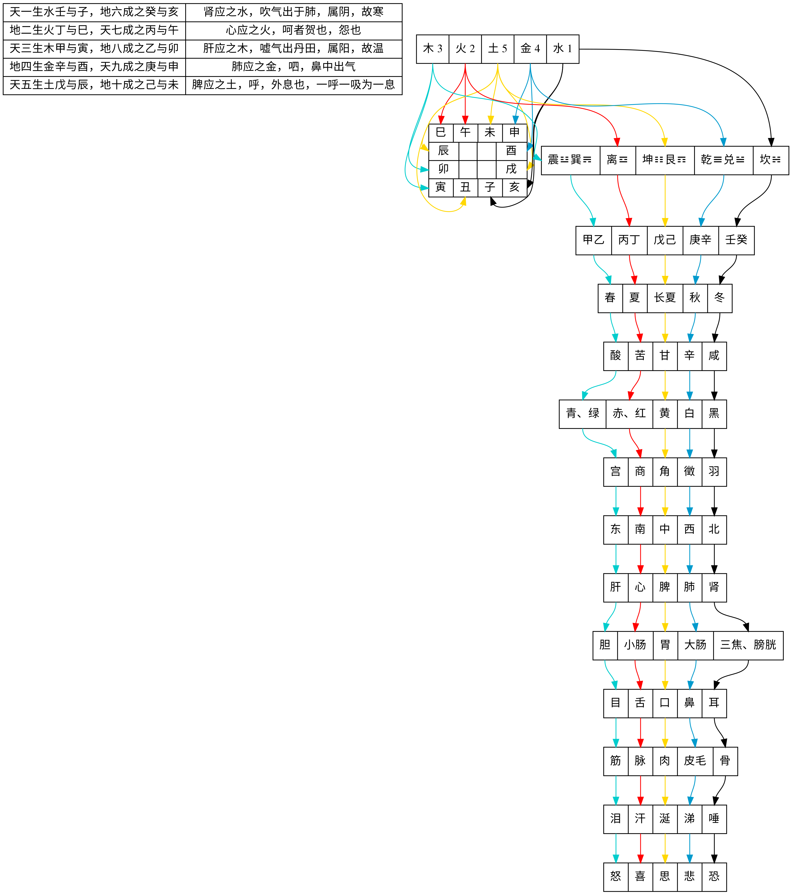

- https://www.qihuang.vip/book.php
- http://www.jingfangzhijia.cn/


###《素问玄机原病式》（金　刘完素　著于公元1186年）
- https://www.qihuang.vip/book-123.html
- **五运主病**
    - 诸风掉眩，皆属肝木。  
> 掉，摇也。眩，昏乱旋运也。风主动故也。所谓风气甚，而头目眩运者，由风木旺，必是金衰不能制木，而木复生火，风火皆属阳，多为兼化，阳主乎动，两动相搏，则为之旋转。故火本动也，焰得风则自然旋转。如春分至小满，为二之气，乃君火之位；自大寒至春分七十三日，为初之气，乃风木之位，故春分之后，风火相搏，则多起飘风，俗谓之旋风是也。四时皆有之。由五运六气，千变万化，冲荡击搏，推之无穷，安得失时而便谓之无也？但有微甚而已，人或乘车跃马，登舟环舞，而眩晕者，其动不正，而左右纡曲，故经曰：曲直动摇，风之用也。眩运而呕吐者，风热甚故也。
    - 诸痛痒疮疡，皆属心火。  
> 人近火气者，微热则痒，热甚则痛，附近则灼而为疮，皆火之用也。或痒痛如针轻刺者，犹飞迸火星灼之然也。痒者，美疾也。故火旺于夏，而万物蕃鲜荣美也。灸之以火，渍之以汤，而痒转甚者，微热之所使也。因而痒去者，热令皮肤纵缓，腠理开通，阳气得泄，热散而去故也。或夏热皮肤痒，而以冷水沃之不去者，寒能收敛，腠理闭密，阳气郁结，不能散越，怫热内作故也。痒得爬而解者，爬为火化，微则亦能令痒，甚则痒去者，爬令皮肤辛辣，而属金化，辛能散，故金化见则火力分而解矣。或云痛为实、痒为虚者，非谓虚为寒也，正谓热之微甚也。或疑疮疡皆属火热，而反腐烂出脓水者，何也？犹谷肉果菜，至于热极，则腐烂而溃为污水也。溃而腐烂者，水之化也。所谓五行之理，过极则胜己者反来制之，故火热过极，则反兼于水化。又如盐能固物，令不腐烂者，咸寒水化，制其火热，使不过极，故得久固也。万物皆然。
    - 诸湿肿满，皆属脾土。  
> 地之体也，土。热极盛则痞塞肿满，物湿亦然。故长夏属土，则庶物隆盛也。
    - 诸气膹郁病痿，皆属肺金。  
> 膹，谓膹满也。郁，谓奔迫也。痿，谓手足痿弱，无力以运动也。大抵肺主气，气为阳，阳主轻清而升，故肺居上部，病则其气膹满奔迫，不能上升；至于手足痿弱，不能收持，由肺金本燥，燥之为病，血液衰少，不能营养百骸故也。经曰：手指得血而能摄，掌得血而能握，足得血而能步。故秋金旺则雾气蒙郁，而草木萎落，病之象也。萎，犹痿也。
    - 诸寒收引，皆属肾水。  
> 收敛引急，寒之用也。故冬寒则拘缩矣。


- **六气为病**
    - 风
> 诸暴强直，肢痛软戾，里急筋缩，皆属于风。（足厥阴风木乃肝胆之气也。）
    - 热
> 诸病喘呕吐酸，暴注下迫，转筋，小便浑浊，腹胀大，鼓之如鼓，痈疽疡疹，瘤气结核，吐下霍乱，瞀郁肿胀，鼻窒鼽衄，血溢血泄，淋閟身热。恶寒战栗，惊惑悲笑，谵妄，衄衊血汙，皆属于热。（手少阴君火之热乃真心小肠之气也。）
    - 湿
> 诸痉强直，积饮痞隔中满，霍乱吐下，体重，胕肿肉如泥，按之不起，皆属于湿。（足太阴湿土乃脾胃之气也。）
    - 火
> 诸热瞀瘛，暴瘖冒昧，躁扰狂越，骂詈惊骇，胕肿疼酸，气逆冲上，禁栗如丧神守，嚏呕，疮疡，喉痹，耳鸣及聋，呕涌溢食不下，目昧不明，暴注瞤瘛，暴病暴死，皆属于火。（手少阳相火之热乃心包络三焦之气也。）
    - 燥
> 诸涩枯涸，干劲皴揭，皆属于燥。（手阳明燥金乃肺与大肠之气也。）
    - 寒
> 诸病上下所出水液，澄澈清冷，癥瘕㿗疝，坚痞腹满急痛，下利清白，食已不饥，吐利腥秽，屈伸不便，厥逆禁固，皆属于寒。（足太阳寒水乃肾与肠胱之气也。）


### 《伤寒论<条文注解版>》（东汉　张仲景　著于公元150-219年）
- https://www.qihuang.vip/book-110.html


### 倪海厦推荐的八本书

```text 
1、《伤寒论辑义》
2、《证因方论集要》
3、《世补斋医书》
4、《徐灵胎医书全集》
5、《伤寒杂病论一张仲景》
6、《石室秘录》 `https://www.qihuang.vip/book-243.html`
7、《黄帝外经》
8、《伤寒论解说一大塚敬节》
```


### 《本草征要》(明　李中梓　著于公元1673年)

#### 谈中药的变通使用

> 中药的资源，相当丰富，中药的品种，相当繁多。我国疆域广大，过去由于交通的不便，尽管是甲地易得之品，往往乙地又有一时不济现象。  
> 再则，有些药材，本身就是很稀少的东西。所以古代医家，便想出种种解决的方法来，不但作为权宜之计，而且形诸笔墨，留给后人参考。  
> 考中药代用之法，由来已久，张仲景称无猪胆以羊胆代之，又说，无胆亦可用。《金匮·杂疗方》治饮食中毒方，用苦酒，而方后云：“或以水煮亦得”。  
> 仲景以后方书，类此者，又层见不穷。今将此类资料，梳剔整理，述其要者，归纳成类，供从事中医中药者之参考。  


**1.限于地域的变通使用**    

（1）植物——《本事方》引柳柳州纂《救死方》用橘叶，注云：“北地无叶，以皮代之”。又《圣济总录》治干脚气之杉节汤，亦用橘叶，注云：“皮亦得”。当是考虑北地使用之故。  
（2）水类——《千金方》风眩薯蓣汤，用江水，注云：“秦中无江水处，以千里东流水代之”。又《琐碎录》治痔漏，以海水煎汤熏洗，注云：“入盐煎亦得”。《苏沈良方》治肠痔，用河水，注云：“井水亦得”。《鸡峰普济方》及《圣济总录》均有同样记载。  


**2.照顾少数民族习惯的变通使用**    

> 古方中变通使用之法，颇有可供少数民族地区医疗工作之参考者，特辑为一类，其最初立方，虽不必因此而设，但是，能以启发吾辈，俾得触类旁通。  
>《千金方》肺虚寒门用猪胰，注云：“无猪胰，以羊胰代”。《圣惠方》治妇人乳痈方以猪胆汁调服，注云：“以醋浆水服之亦得”。  
>《圣济总录》摩傅神明膏用猪膏，注云：“以牛酥代猪膏亦佳”。《圣惠方》治头疮方用猪脂调涂，注云：“用麻油调亦可”。  


**3.季节性的变通使用**    
（1）冬雪夏水——魏氏鼻衄奇效散，须“频用雪块熨药上”。注云：“无雪只冷水扫”。《保幼大全》治疮，用雪水，以雪水须预藏，故注云：“无雪水，用新水”。  
（2）冬根夏叶——《博爱心鉴》谓水杨：“春冬用枝，秋夏用叶”。《备急方》疗口中及舌上生疮方用蔷薇根，注云：“冬用根，夏用枝叶”。《圣惠方》治妇人乳痈方用蔓菁叶，注云“冬无叶，即用根也”。  
（3）冬用干者——《古今录验》苏子汤，用苏子及生苏叶，注云：“冬天煮干枝、茎叶亦佳”。《千金方》妊娠尿血方用生艾叶，注云：“冬用干者”。  


**4.鲜货与干货的变通使用**    
（1）干代鲜——《圣惠方》治难产方“益母草捣汁三合，如无生者，用干者一握，以水煎服”。  
《圣济总录》治舌上出血清心散用刺蓟研绞取汁，注云：“如无生汁，只捣干者为末，冷水调下”。  
 又治小儿脾热方用桑根白皮，取自然汁，注云：“如无新桑根白皮，取干桑白皮，细锉水煎”。  
 干姜代生姜，文献极多，如《深师方》五味子汤，《古今录验》桂心汤等均是。  
（2）鲜代干——《肘后方》治笃病新起早劳方用干苏，注云：“无干者，生亦可用”。  
（3）分两须有变动——《本草新编》云：“蒲公英百斤，无鲜草可用干者，干则不必百斤。三十斤便可，熬膏取七斤也”。  
《全婴方论》有云：“如无生地黄，只用干地黄，每干地黄五两，当生地黄一斤。”以上为干须减量之例。《直指方》肠痈四圣散中，有生栝蒌一枚，注云：“若干栝蒌，则用两枚。”又是干须加量之例。  


**5.不同部份的变通使用**
> 这一类的文献很多，各举一二例，恕不详引。

（1）根代叶——《是斋百一选方》治小儿走马疳，用芭蕉杆或叶，注云：“无即用根”。  
（2）根或根皮代花——《小品方》茅花汤云：“若无茅花，取茅根代之亦可”。  
    又《伤寒百问歌》治鼻衄方云：“无（茅）花，可以茅根代之”。  
    《妇人良方》疗妇人乳痈方，以芙蓉花研烂，注云：“若无花，只取根上皮，先用竹刀，刮去粗皮，但用内一层嫩白皮，研烂”。  
    《经验秘方》仙方香连丸用葛花，注云：“无葛花，以葛粉代之”。葛粉乃葛根中之淀粉也。  
（3）根代子——《证类本草》黄蜀葵条引《经验后方》用黄蜀葵子，注云：“如无子，以根细切，煎汁令浓滑、待冷服”。  
（4）侧根（子根）代主根（母根）——《古今录验》牡丹丸中用乌头，注云：“无乌头，附子亦可炮用之”。  
    又《方氏家藏方》健脾散，亦以附子代乌头。  
（5）茎、叶代子——《澹寮方》苦参圆：“苍耳子，无，则以茎叶代用”。《圣惠方》治龋齿方，用葫芦子，注云：“茎叶亦可用”。  
（6）苗、叶、子代瓜——《圣济总录》消渴竹龙散用冬瓜，注云：“无冬瓜，用冬瓜苗、叶、子煎汤俱可”。  
（7）枝代果、子——《圣惠方》治妊娠霍乱转筋方用木瓜，注云：“如无木瓜，煎枝亦佳”。  
    《圣济总录》胞衣不出槐子汤注云：“如无（槐）子用枝”。  
（8）茎叶代花——《外科精要》金银花散注云：“无花，用苗叶嫩茎代之”。  
（9）花代根、叶、子——《直指方》瞿麦汤，“如无茅根，只用茅花”。  
    《圣济总录》肝藏风毒天麻汤用甘菊叶，注云：“如无叶，以花代”。扬氏紫草散用红花子。注云：“如无，红花代之”。  
（10）子代叶、花——《肘后备急方》疗小儿蠼螋疮方用蒺藜叶，注云：“无叶，子亦可。”  
    《妇人良方》催生葵子散用黄蜀葵花，注云：“无花时，只用葵子。”  
（11）核代果——《朱氏集验方》治骨鲠方用橄榄，注云：“若无橄榄，核烧为炭，亦可”。  
（12）骨代脏——《千金翼方》补虚劳方用羊心、肺、肝、肚、肾。注云：“若无羊五脏，羊骨亦可用之”。  
（13）角代茸——《寿亲养老书》中有鹿茸方，注云：“如无，以鹿角屑代之亦妙”。  


**6.同类品的变通使用**

（1）同称异物——《叶氏录验》有用葵叶方，注云：“如无葵叶，蜀葵子亦得”。  
（2）同物异称——《妇人良方》舒经汤云：“无姜黄，用嫩莪术代之”。  
（3）同是油类——《外科精要》白龙膏，用杏子油，注云：“芝麻油亦可”。  
（4）同类而易得——《活人事证后集》糜茸圆注云：“无糜茸，以鹿茸代”。《活幼口议》暖金丹，“无牛黄，以黄牛胆代，加用”。  


**7.功效相似的变通使用**

（1）疗风——《千金翼方》秦王续命大八风散，用牡荆子，注云：“若无，用柏子仁代”。  
（2）润燥养阴——《活幼口议》黄芪散，用天门冬，注云，“麦门冬亦得”。  
（3）保肺——《圣济总录》咳嗽百部煎用生百合汁，注云：“如无，以藕汁代”。  
（4）宁心——魏氏小儿安神圆用琥珀，注云：“如无琥珀，以茯神代之”。  
（5）风痹——《朱氏集验方》独活寄生汤注云：“无桑寄生，则以川续断代”。  
（6）除痰——《卫生家宝》中暑地榆夺命散用牛胆制天南星，注云：“如无，以法制半夏代之”。  
（7）解热——《经心录》漏芦汤用白薇，注云：“如无，则用知母”。《卫生宝鉴》地仙丹用青蒿，注云，“如无，则用竹叶。”  
（8）止血——《伤寒蕴要》及《医碥》生地黄汤，均用生藕自然汁，无藕则用刺蓟汁，再无则用刺蓟末。  
（9）活血——《千金方》之远志汤；茯苓汤；白芷圆；内补当归汤；及《外台秘要》引深师温脾丸，均以川芎代当归。  
（10）退黄——《医宗金鉴》于麻黄连轺赤小豆汤下注云：“无梓皮，以茵陈代之”。  
（11）下气——《寿亲养老书》云：“如无乌药，用厚朴亦得”。《兰台轨范》引局方藿香正气散注云：“大腹皮换槟榔亦可”。  
（12）温中——《肘后方》治心腹痛方云：“无桂，用干姜亦佳”。  
（13）通下——《经心录》漏芦汤云：“无大黄用芒硝。”  
（14）利水——《千金方》甘草圆有泽泻，注云：“无泽泻，以白术代之”。  
（15）温肾——《活人事证》十柔圆有苁蓉，注云：“无以鹿茸代之”。  
（16）调经——《妇人明理方》谓“丹参一味，主治与四物相同”。  
（17）外用治汤火伤——《圣惠方》治汤火所灼方用柳白皮，注云：“用柏白皮亦佳”。  


**8.代用其一两种功效**

> 前一类，是治疗功效，大致相若的，即某某可代某某。这一类，是仅代其一两种功效的，如茯苓代人参定心则可，代其它功能即不适宜。具体材料，仍分数类列下。  

（1）定心——《千金翼方》淡竹茹汤（亦见千金，但叙述较略），注云：“若有人参，内一两，若无人参内茯苓一两半，亦佳，人参茯苓，皆治心烦闷及心惊悸，安定精神，有即为良”。  
（2）除烦——《广济方》血气烦闷方用生藕，注云：“竹沥亦得”。  
（3）发血中之表——张文仲疗晚发伤寒方用地黄，注云：“无地黄，用豉一升”。《温病条辨》谓生地能发血中之表，此用豆豉，亦代其发表也。  
（4）止血兼化瘀——《千金方》白芷圆注云：“无续断，以大蓟根代之”。 大蓟根仅代续断之止血化瘀作用，其它不能代也。  
（5）下气——《圣济总录》小儿吐逆丁香汤，用花桑叶，注云：“如无，则以枇杷叶代”。  
（6）宣中——《朱氏集验方》仙茅散，注云：“无仙茅，则以好苍术代之”。  
（7）牙疼——魏氏姜黄散，注云：“偶无姜黄，检本草云：川芎亦治牙疼，遂以代之”。  
（8）解毒——《千金方》伤寒木香汤，内有犀角，注云：“无犀角，以升麻代之”。  


**9.应急的变通使用**

（1）——《圣济总录》苏合香丸注云：“仓猝求人参不得，只白汤亦佳”。  
（2）——同上、治伤寒狂躁大安丸注云：“如缓急无地黄汁，新水化下”。  
（3）——魏氏中风木香附子汤注云：“附子炮去皮脐，若急中，不炮”。  
（4）——《肘后方》救猝死方破白犬以覆心上，注云：“无白犬，小鸡亦佳”。  


**10.降格以求、甚至缺之亦可**

（1）地道问题——《朱氏集验方》木瓜败毒散注云：“无宣瓜，寻常木瓜亦可。”  
（2）品种问题——《千金方》治黄疸方，用小麦苗，捣绞取汁。注云：“无小麦苗，野麦苗亦得”。范注云：“用小麦胜也”。  
（3）大小——《广济方》下乳汁用栝蒌，须青色大者，注云：“若无大者，用小者两枚。”又《圣济总录》脚气木瓜丸用木瓜大者一枚，注云：“小者两枚亦可”。  
（4）颜色——《广济方》下乳汁用栝蒌，须青色大者。又注云：“无青色者，黄色者亦好”。  
（5）触类旁通——《卫生家宝》紫金丹中用鹿脊骨，注云：“以羊脊骨代之亦得”。《直指方》吐血地黄煎用鹿胶，注云：“无鹿胶，以透明阿胶代用”。《方氏家藏方》王医师麝香鹿茸圆用鹿角胶和丸，注云：“如无鹿角胶，蜜和亦得。”  
（6）废物利用——《肘后方》治霍乱方注云：“无新药，煮滓亦得”。  
（7）缺之亦可——《幼幼新书》引婴孺黄芪散，注云：“若无黄芪，可缺也”。《济生方》五香连轺汤注云：“桑寄生，无真者，宁缺之”。《施氏续易简方》丁附汤，注云：“急切，无丁香亦得”。又《肘后方》治水病方亦云：“无苏合，可缺之也”。  


**11.结语**

> 以上就已有材料，分为十类。古人有言，“世无难治之病，有不善治之医；药无难代之品，有不善代之人”。观于上引种种，可悉变通使用，亦是一门学问，灵活而不呆板，辨证而不机械，若能通盘掌握，豁然于胸，自可随机应变。  
> 中医诊疗之特点，在于辩症论治，理、法、方、药，自有其规矩绳墨，然法有定而方药无定，立法既准，使用何药，可以广为选择，所以不惮辞费而广征博引者，意在多所启发，广我思路，俾临症使用时之灵活变通耳。  
> 若不加变化，目其为固定不移，认为某某等于某某，恐终将行之鲜效，则又非演述者落笔之本意也。  

> 从上引材料里，可以反映出，祖国的药用资源，是极其广泛的。过去的医务工作者，在向疾病作斗争的过程中，是有其丰富经验的。就所录各条来看，有很多代用之品，并未载于本草书。  
> 温习此项材料，可以广开思路，对于扩大药源并充分的利用原有药材来说，会有一些参考意义。  
> 近年来，各地民间贡献出许多单方草药，编纂了许多草药方书，在群众的防病治病方面，在城乡的保建医疗方面，都发挥了巨大的作用。  


### 《心印绀珠经》(元　李汤卿　著于公元1368年)


```text
东垣报使

太阳　羌活　黄柏
阳明　白芷　升麻　石膏
少阳　柴胡　青皮
太阴　白芍药
少阴　知母
厥阴　青皮　柴胡

小肠膀胱属太阳，藁本羌活是本方。
三焦胆与肝包络，少阳厥阴柴胡强。
阳明大肠兼足胃，葛根白芷升麻当。
太阴肺脉中焦起，白芷升麻葱白乡。
脾经少与肺经异，升麻芍药白芷详。
少阴心经独活主，肾经独活加桂良。
通经用此药为使，更有何病到膏肓。

```


###《丹溪心法》(元末明初　朱震亨　著于公元1481年) 

#### 关于 痰 的部分

> 脉浮当吐。久得脉涩，卒难开也，必费调理。大凡治痰用利药过多，致脾气虚，则痰易生而多。

- 湿痰，用苍术、白术；
- 热痰，用青黛、黄连、芩；
- 食积痰，用神曲、麦芽、山楂；
- 风痰用南星；
- 老痰用海石、半夏、瓜蒌、香附、五倍子作丸服；
- 痰在膈上必用吐法，泻亦不能去；
- 风痰多见奇证；
- 湿痰多见倦怠软弱；
- 气实痰热，结在上者，吐难得出；
- 痰清者属寒，二陈汤之类；
- 胶固稠浊者，必用吐；
- 热痰挟风，外证为多。热者清之；
- 食积者，必用攻之；
- 兼气虚者，用补气药送。
- 痰因火盛逆上者，以治火为先，白术、黄芩、软石膏之类；
- 内伤挟痰，必用参、芪、白术之属，多用姜汁传送，或加半夏，虚甚，加竹沥；
- 中气不足，加参、术。
- 痰之为物，随气升降，无处不到。
- 脾虚者，宜清中气以运痰降下，二陈汤加白术之类，兼用升麻提起。
- 中焦有痰则食积，胃气亦赖所养，卒不便虚，若攻之尽，则虚矣。
- 痰成塊，或吐咯不出，兼气郁者，难治；
- 气实痰热者，难治；
- 痰在肠胃间者，可下而愈；
- 在经络中，非吐不可。
- 吐法中就有发散之义焉。
- 假如痫病，因惊而得，惊则神出舍，舍空则痰生也。
- 血气入在舍，而拒其神，不能归焉。
- 血伤必用姜汁传送。
- 黄芩治热痰，假其下火也。
- 竹沥滑痰。非姜汁不能行经络。
- 五倍子能治老痰，佐他药，大治顽痰。
- 二陈汤一身之痰都治管，如要下行，加引下药；在上，加引上药。
- 凡用吐药，宜升提其气，便吐也，如防风、山栀、川芎、桔梗、芽茶、生姜、齑汁之类或用瓜蒂散。
- 凡风痰病，必用风痰药如白附子、天麻、雄黄、牛黄、片芩、姜蚕，猪牙皂角之类。（诸吐法另具于后）


> 凡人身上中下有块者多是痰，问其平日好食何物，吐下后，方用药。许学士用苍术治痰成窠囊一边行，极妙。


- 痰挟瘀血，遂成窠囊。
- 眩晕嘈杂，乃火动其痰，用二陈汤加山栀子、黄连、黄芩之类。
- 噫气吞酸，此食郁有热，火气上动，以黄芩为君，南星、半夏为臣，橘红为使，热多加青黛。
- 痰在胁下，非白芥子不能达；
- 痰在皮里膜外，非姜汁、竹沥不可导达；
- 痰在四肢，非竹沥不开；
- 痰结核在咽喉中，燥不能出入，用化痰药加咸药软坚之味，瓜蒌仁、杏仁、海石、桔梗、连翘，少佐朴硝，以姜汁蜜和丸，噙服之。海粉即海石，热痰能降，湿痰能燥，结痰能软，顽痰能消，可入丸子、末子，不可入煎药。
- 枳实泻痰，能冲墙壁。
- 小胃丹治膈上痰热、风痰、湿痰、肩膊诸痛，能损胃气，食积痰实者用之，不宜多。
- ○喉中有物咯不出，咽不下，此是老痰。重者吐之，轻者用瓜蒌辈，气实必用荆沥。
- 天花粉大能降膈上热痰。
- 痰在膈间，使人颠狂，或健忘，或风痰，皆用竹沥，亦能养血，与荆沥同功。治稍重能食者，用此二味效速稳当。二沥治痰结在皮里膜外，及经络中痰，必佐以姜汁。韭汁治血滞不行，中焦有饮。自然汁冷吃两三银盏，必胸中烦燥不宁，后愈。参萸丸能消痰。


```text
凡痰之为患，为喘为咳，为呕为利，为眩为晕，心嘈杂怔忡惊悸，为寒热痛肿，为痞隔，为壅塞，或胸胁间辘辘有声，或背心一片常为冰冷，或四肢麻痹不仁，皆痰饮所致。

善治痰者，不治痰而治气，气顺则一身之津液，亦随气而顺矣。
又严氏云：人之气道贵乎顺，顺则津液流通，决无痰饮之患。
古方治痰饮，用汗、吐、下、温之法。
愚见不若以顺气为先，分导次之。
又王隐君论云：痰清白者为寒，黄而浊者为热，殊不知始则清白，久则黄浊。清白稀薄渍于上，黄浊稠粘凝于下。嗽而易出者清而白也，咳而不能出则黄浊结滞也。若咯唾日久，湿热所郁，上下凝结，皆无清白者也。甚至带血，血败则黑痰，为关格异病，人所不识。
又清白者气味淡，日久者，渐成恶味，酸辣、腥臊、焦苦不一。百病中，多有兼痰者，世所不知也。凡人身中有结核，不痛不红，不作脓者，皆痰注也。治痰法，实脾土，燥脾湿，是治其本也。


```


### 摘自 千金要方


### 《药对》
> 《药对》曰：夫众病积聚，皆起于虚，虚生百病。
> 积者，五藏之所积；
> 聚者，六腑之所聚。如斯等疾，多从旧方，不假增损。 虚而劳者，其弊万端，宜应随病增减。
> 古之善为医者，皆自釆药，审其体性所主，取其时节早晚，早则药势未成，晚则盛势已歇。
> 今之为医，不自采药，且不委节气早晚，只共采取，用以为药，又不知冷热消息，分两多少，徒有疗病之心，永无必愈之效。此实浮惑，聊复审其冷热，记其增损之主耳。

- 虚劳而苦头痛复热，加枸杞、萎蕤；
- 虚而欲吐，加人参；
- 虚而不安，亦加人参；
- 虚而多梦纷纭，加龙骨；
- 虚而多热，加地黄、牡蛎、地肤子、甘草；
- 虚而冷，加当归、芎藭、干姜；
- 虚而损，加钟乳、棘刺、肉苁蓉、巴戟天；
- 虚而大热，加黄芩、天门冬；
- 虚而多忘，加茯神、远志；
- 虚而惊悸不安，加龙齿、紫石英、沙参、小草，冷则用紫石英、小草，若客热即用沙参、龙齿，不冷不热无用之；
- 虚而口干，加麦门冬、知母；
- 虚而吸吸，加胡麻、覆盆子、柏子仁；
- 虚而多气兼微咳，加五味子、大枣；
- 虚而身强，腰中不利，加磁石、杜仲；
- 虚而多冷，加桂心、吴茱萸、附子、乌头；
- 虚而小便赤，加黄芩；
- 虚而客热，加地骨皮、白水黄耆；
- 虚而冷，用陇西黄耆：
- 虚而痰，复有气，加生姜、半夏、枳实；
- 虚而小肠利，加桑螵蛸、龙骨、鸡肶胵；
- 虚而小肠不利，加茯苓、泽泻；
- 虚而溺白，加厚朴。
诸药无有一一历而用之，但据体性冷热，的相主对，聊叙增损之一隅，入处方者宜准此。


#### 君臣佐使

- 上品，无毒之药，为君；
- 中品，小毒之药，为臣；
- 下品，大毒之药，为佐使。

> 此本草论药之性体也。主病者为之君，摄君者谓之臣，应臣者谓之佐使，此《内经》论药之能用也。
> 如治诸热，则以黄连、黄芩为君。
> 治诸寒，则以乾姜、附子为君。
> 治表实，则以麻黄、柴胡为君。
> 治表虚，则以升麻、葛根为君。
> 治里实，则以大黄、芒硝为君。
> 治里虚，则以甘草、芍药为君。
> 君药分两最多，臣药次之，佐使药又次之，不可令臣过于君，君臣有序，相与宜摄，可以御邪除病矣。


- **君**
    - `上药一百二十种，为君，主养命以应天，无毒，多服久服不伤人，欲轻身益气，不老延年者，本上经；`
- **臣**
    - `中药一百二十种，为臣，主养性以应人，有毒无毒，斟酌其宜，欲遏病补虚羸者，本中经；`
- **佐使**
    - `下药一百二十五种，为佐使，主治病以应地，多毒，不可久服，欲除寒热邪气，破积聚，愈疾者，本下经。`
- `三品合三百六十五种，法三百六十五度，每一度应一日，以成一岁，倍其数，合七百三十名也。`

> 凡药有君臣佐使，以相宣摄。合和者宜用一君二臣三佐五使，又可一君三臣九佐使也。
> 又有阴阳配合，子母兄弟，根茎花实，草石骨肉。
> 有单行者，有相须者，有相使者，有相畏者，有相恶者，有相反者，有相杀者。
> 凡此七情，合和之时，用意视之。当用相须相使者，良勿用相恶相反者。若有毒宜制，可用相畏相杀者，不尔勿合用也。
> 又有酸咸甘苦辛五味，又有寒热温凉四气，及有毒无毒，阴干暴干，采造时月，生熟土地所出，真伪陈新，并各有法。
> 其相使相畏七情列之如左，处方之日宜善究之。

```text

〔玉石上部〕

玉泉　畏款冬花。
玉屑　恶鹿角。
丹砂　恶磁石，畏咸水。
曾青　畏菟丝子。
石胆　水英为使，畏牡桂、菌桂、芫花、辛夷、白薇。
云母　泽泻为使，畏鮀甲及流水，恶徐长卿。
钟乳　蛇床子、菟丝子为使，恶牡丹、玄石、牡蒙，畏紫石英、蘘草。
朴消　畏麦句姜。
消石　火为使，恶苦参、苦菜，畏女菀。
芒消　石韦为使，恶麦句姜。
矾石　甘草为使，恶牡蛎。
滑石　石韦为使，恶曾青。
紫石英　长石为使，畏扁青、附子，不欲鮀甲、黄连、麦句姜。
白石英　恶马目毒公。
赤石脂　恶大黄，畏芫花。
黄石脂　曾青为使，恶细辛，畏蜚蠊、扁青、附子。
白石脂　燕粪为使，恶松脂，畏黄芩。
太一余粮　杜仲为使，畏铁落、菖蒲、贝母。

〔玉石中部〕

水银　畏磁石。
殷孽　恶防己，畏术。
孔公孽　木兰为使，恶细辛。
阳起石　桑螵蛸为使，恶泽泻、菌桂、雷丸、蛇蜕皮，畏菟丝子。
凝水石　畏地榆，解巴豆毒。
石膏　鸡子为使，恶莽草、毒公。
磁石　柴胡为使，畏黄石脂，恶牡丹、莽草。
玄石　恶松脂、柏子仁、菌桂。
理石　滑石为使，畏麻黄。

〔玉石下部〕

青琅玕　得水银良，畏鸡骨，杀锡毒。
礜石　得火良，棘针为使，恶虎掌、毒公、鹜屎、细辛，畏水。
特生礜石　得火良，畏水。
方解石　恶巴豆。
代赭　畏天雄。
大盐　漏芦为使。

〔草药上部〕

六芝　署预为使，得发良，恶恒山，畏扁青、茵陈。
天门冬　垣衣、地黄为使，畏曾青。
麦门冬　地黄、车前为使，恶款冬、苦瓠，畏苦参、青蘘。
术　防风、地榆为使。
女萎萎蕤　畏卤咸。
干地黄　得麦门冬、清酒良，恶贝母，畏芜荑。
菖蒲　秦艽、秦皮为使，恶地胆、麻黄。
远志　得茯苓、冬葵子、龙骨良，杀天雄、附子毒，畏真珠、蜚廉、藜芦、齐蛤。
泽泻　畏海蛤、文蛤。
署预　紫芝为使，恶甘遂。
菊花　术、枸杞根、桑根白皮为使。
甘草　术、干漆、苦参为使，恶远志，反甘遂、大戟、芫花、海藻。
人参　茯苓为使，恶溲疏，反藜芦。
石斛　陆英为使，恶凝水石、巴豆，畏白僵蚕、雷丸。
牛膝　恶萤火、龟甲、陆英，畏车前。
细辛　曾青、枣根为使，恶狼毒、山茱萸、黄耆，畏滑石、消石，反藜芦。
独活　蠡实为使。
柴胡　半夏为使，恶皂荚，畏女菀、藜芦。
菴䕡子　荆子、薏苡仁为使，恶细辛、干姜。
菥蓂子　得荆子、细辛良，恶干姜、苦参。
龙胆　贯众为使，恶防葵、地黄。
菟丝子　得酒良，署预、松脂为使，恶雚菌。
巴戟天　覆盆子为使，恶朝生、雷丸、丹参。
蒺藜子　乌头为使。
防风　恶干姜、藜芦、白敛、芫花，杀附子毒。
络石　杜仲、牡丹为使，恶铁落，畏菖蒲、贝母。
黄连　黄芩、龙骨、理石为使，恶菊花、芫花、玄参、白鲜皮，畏款冬，胜乌头，解巴豆毒。
沙参　恶防己，反藜芦。
丹参　畏咸水，反藜芦。
天名精　垣衣为使。
决明子　蓍实为使，恶大麻子。
芎藭　白芷为使。
续断　地黄为使，恶雷丸。
黄耆　恶龟甲。
杜若　得辛夷细辛良，恶柴胡、前胡。
蛇床子　恶牡丹、巴豆、贝母。
茜根　畏鼠姑。
飞廉　得乌头良，恶麻黄。
薇衔　得秦皮良。
五味子　苁蓉为使，恶萎蕤，胜乌头。

〔草药中部〕

当归　恶䕡茹，畏菖蒲、海藻、牡蒙。
秦艽　菖蒲为使。
黄芩　山茱萸、龙骨为使，恶葱实，畏丹砂、牡丹、藜芦。
芍药　雷丸为使，恶石斛、芒消，畏消石、鳖甲、小蓟，反藜芦。
干姜　秦椒为使，恶黄连、黄芩、天鼠粪，杀半夏、莨菪毒。
藁本　恶䕡茹。
麻黄　厚朴为使，恶辛夷、石韦。
葛根　杀野葛、巴豆、百药毒。
前胡　半夏为使，恶皂角，畏藜芦。
贝母　厚朴、白薇为使，恶桃花，畏秦艽、礜石、莽草，反乌头。
栝楼　枸杞为使，恶干姜，畏牛膝、干漆，反乌头。
玄参　恶黄耆、干姜、大枣、山茱萸，反藜芦。
苦参　玄参为使，恶贝母、漏芦、菟丝子，反藜芦。
石龙芮　大戟为使，畏蛇蜕皮、吴茱萸。
石韦　滑石、杏仁为使，得菖蒲良。
狗脊　萆薢为使，恶败酱。
萆薢　薏苡为使，畏葵根、大黄、柴胡、牡蛎、前胡。
瞿麦　蘘草、牡丹为使，恶桑螵蛸。
白芷　当归为使，恶旋复花。
紫菀　款冬为使，恶天雄、瞿麦、雷丸、远志，畏茵陈。
白鲜皮　恶桑螵蛸、桔梗、茯苓、萆薢。
白薇　恶黄耆、大黄、大戟、干姜、干漆、大枣、山茱萸。
紫参　畏辛夷。
仙灵脾　署预为使。
款冬花　杏仁为使，得紫菀良，恶皂荚、消石、玄参，畏贝母、辛夷、麻黄、黄芩、黄连、黄耆、青葙。
牡丹　畏菟丝子。
防己　殷孽为使，恶细辛，畏萆薢，杀雄黄毒。
女菀　畏卤咸。
泽兰　防己为使。
地榆　得发良，恶麦门冬。
海藻　反甘草。

〔草药下部〕

大黄　黄芩为使。
桔梗　节皮为使，畏白及龙胆、龙眼。
甘遂　瓜蒂为使，恶远志，反甘草。
葶苈　榆皮为使，得酒良，恶僵蚕、石龙芮。
芫花　决明为使，反甘草。
泽漆　小豆为使，恶署预。
大戟　反甘草。
钩吻　半夏为使，恶黄芩。
藜芦　黄连为使，反细辛、芍药、五参，恶大黄。
乌头乌喙　莽草为使，反半夏、栝楼、贝母、白敛、白及，恶藜芦。
天雄　远志为使，恶腐婢。
附子　地胆为使，恶蜈蚣，畏防风、甘草、黄耆、人参、乌韭、大豆。
贯众　雚菌为使。
半夏　射干为使，恶皂荚，畏雄黄、生姜、干姜、秦皮、龟甲，反乌头。
虎掌　蜀漆为使，畏莽草。
蜀漆　栝楼为使，恶贯众。
恒山　畏玉札。
狼牙　芜荑为使，恶秦艽、地榆。
白敛　代赭为使，反乌头。
白及　紫石英为使，恶理石、李核仁、杏仁。
雚菌　得酒良，畏鸡子。
䕡茹　甘草为使，恶麦门冬。
荩草　畏鼠妇。
夏枯草　土瓜为使。
狼毒　大豆为使，恶麦句姜。
鬼臼　畏垣衣。

〔木药上部〕

茯苓茯神　马蕳为使，恶白敛，畏牡蒙、地榆、雄黄、秦艽、龟甲。
柏子仁　牡蛎、桂心、瓜子为使，畏菊花、羊蹄、诸石、面曲。
杜仲　恶蛇蜕、玄参。
干漆　半夏为使，畏鸡子。
蔓荆子　恶乌头石膏。
牡荆实　防风为使，恶石膏。
五加皮　远志为使，畏蛇蜕、玄参。
黄蘗　恶干漆。
辛夷　芎藭为使，恶五石脂，畏菖蒲、蒲黄、黄连、石膏、黄环。
酸枣仁　恶防己。
槐子　天雄、景天为使。

〔木药中部〕

厚朴　干姜为使，恶泽泻、寒水石、消石。
山茱萸　蓼实为使，恶桔梗、防风、防己。
吴茱萸　蓼实为使，恶丹参、消石、白垩，畏紫石英。
秦皮　大戟为使，恶吴茱萸。
占斯　解狼毒毒。
栀子　解踯躅毒。
秦椒　恶栝楼、防葵，畏雌黄。
桑根白皮　续断、桂心、麻子为使。

〔木药下部〕

黄环　鸢尾为使，恶茯苓、防己。
石南　五加皮为使。
巴豆　芫花为使，恶蘘草，畏大黄、黄连、藜芦，杀斑猫毒。
蜀椒　杏仁为使，畏款冬。
栾华　决明为使。
雷丸　荔实、厚朴为使，恶葛根。
溲疏　漏芦为使。
皂荚　柏子为使，恶麦门冬，畏空青、人参、苦参。

〔兽上部〕

龙骨　得人参、牛黄良，畏石膏。
龙角　畏干漆、蜀椒、理石。
牛黄　人参为使，恶龙骨、地黄、龙胆、蜚蠊，畏牛膝。
白胶　得火良，畏大黄。
阿胶　得火良，畏大黄。

〔兽中部〕

犀角　松脂为使，恶雚菌、雷丸。
羖羊角　菟丝子为使。
鹿茸　麻勃为使。
鹿角　杜仲为使。

〔兽下部〕

麋脂　畏大黄，恶甘草。

〔虫鱼上部〕

蜜蜡　恶芫花、齐蛤。
蜂子　畏黄芩、芍药、牡蛎。
牡蛎　贝母为使，得甘草、牛膝、远志、蛇床良，恶麻黄、吴茱萸、辛夷。
桑螵蛸　畏旋复花。
海蛤　蜀漆为使，畏狗胆、甘遂、芫花。
龟甲　恶沙参、蜚蠊。

〔虫鱼中部〕

伏翼　苋实、云实为使。
猬皮　得酒良，畏桔梗、麦门冬。
蜥蜴　恶硫黄、班猫、芜荑。
露蜂房　恶干姜、丹参、黄芩、芍药、牡蛎。
䗪虫　畏皂荚、菖蒲。
蛴螬　蜚虫为使，恶附子。
鳖甲　恶矾石。
鮀鱼甲　蜀漆为使，畏狗胆、甘遂、芫花。
乌贼鱼骨　恶白敛、白及。
蟹　杀莨菪毒、漆毒。
天鼠粪　恶白敛、白薇。

〔虫鱼下部〕

蛇蜕　畏磁石及酒。
蜣螂　畏羊角、石膏。
斑猫　马刀为使，畏巴豆、丹参、空青，恶肤青。
地胆　恶甘草。
马刀　得水良。

〔果上部〕

大枣　杀乌头毒。

〔果下部〕

杏仁　得火良，恶黄耆、黄芩、葛根，解锡、胡粉毒，畏莽草。

〔菜上部〕

冬葵子　黄芩为使。

〔菜中部〕

葱实　解藜芦毒。

〔米上部〕

麻蕡麻子　畏牡蛎、白薇，恶茯苓。

〔米中部〕

大豆及黄卷　恶五参、龙胆，得前胡、乌喙、杏仁、牡蛎良，杀乌头毒。

大麦　食蜜为使。

酱　杀药毒、火毒。

右一百九十七种有相制使，其余皆无，故不备录。

或曰：古人用药至少，分两亦轻，差病极多。观君处方，非不烦重，分两亦多，而差病不及古人者何也？答曰：古者日月长远，药在土中，自养经久，气味真实，百姓少欲，禀气中和，感病轻微，易为医疗；
今时日月短促，药力轻虚，人多巧诈，感病厚重，难以为医。病轻用药须少，疴重用药即多，此则医之一隅，何足怪也？又古之医有自将采取，阴干暴干，皆悉如法，用药必依土地，所以治十得九；
今之医者但知诊脉处方，不委釆药时节，至于出处土地，新陈虚实，一皆不悉，所以治十不得五六者，寔由于此。夫处方者，常须加意，重复用药，药乃有力，若学古人，徒自误耳，将来学者须详熟之。

凡紫石英白石英朱砂雄黄硫黄等，皆须光明映澈色理鲜静者为佳，不然，令人身体干燥，发热口干而死。凡草石药，皆须土地坚实，气味浓烈，不尔，治病不愈。凡狼毒枳实橘皮半夏麻黄吴茱萸，皆欲得陈久者良，其余唯须精新也。

```


# 中药的四色五味

## 四气

寒、热、温、凉

- 温热 属 阳；
- 寒凉 属 阴；
- 寒凉药具有清热泻火、凉血解毒
- 温热药具有温里散寒、补火助阳、温经通络、回阳救逆


## 五味

甘补虚、咸泻下、辛散寒、酸收涩、苦清热

- 甘味药：常用治疗虚症、脾胃不和、拘急疼痛，如人参能补元气，熟地黄能滋补精血；
- 咸味药：具有润下、软坚散结的功效，如芒硝可用于治疗大便干结；
- 辛味药: 常用语外感表证、气血瘀滞，如麻黄用于治疗外感性疾病，苏叶能发散风寒；
- 酸味药：收敛、固涩，常用于体虚多汗、肺虚久咳、遗尿、尿频等，如五味子敛精止汗，五倍子涩肠止泻；
- 苦味药：能治热证、喘咳、便秘、湿证、阴虚火旺，如黄芩清热泻火，杏仁降气平喘；


### 《山居四要》(元　汪汝懋　著于公元1360年)

> 里面附加十三方部分， 发现很多都已经被小日子做成药品在全世界卖了


```text

附加十三方

〔一〕

●不换金正气散　治四时伤寒，头疼，发热，恶寒，身体痛，潮热往来，咳嗽痰逆，呕哕恶心，及山岚瘴气并治之。

苍米（米泔浸过）　陈皮（去白，各五钱重）　藿香（三分重）　半夏（炮七次，三分重）　甘草（三钱）　厚朴（姜炙，四分重）

上每服姜五片，葱根煎服。

头疼，加川芎、白芷。
潮热，加黄芩、柴胡。
口燥心烦，加乾葛、柴胡。
冷泻不止，加木香、诃子、肉豆蔻。
疟疾，加常山、槟榔、草果。
咳嗽，加杏仁、五味子、桔梗。
喘急，加麻黄、苏子、桑白皮。
身体疼痛，加桂皮、麻黄、赤芍药。
感寒腹痛，加乾姜、官桂。
呕逆，加丁香、砂仁。
足浮肿，加大腹皮、木瓜皮、五加皮。
气块，加枳壳、槟榔、茴香、三稜。
热极大腑不通，加朴硝、大黄。
腹胀，加香附子、枳壳、白豆蔻。
胸胁胀满，加枳实、莪术、砂仁。
痢疾，加黄连、枳壳，去甘草。

〔二〕

●十神汤　治伤寒，时令不正之气，瘟疫。不问阴阳二证及内外两感风寒，腰脚疼痛，湿痹，头疼，咳嗽，并皆治之。

陈皮（去白，二钱）　麻黄（去节，二分）　川芎（二分）　香附子（三分）　苏叶（二钱）　白芷（二分）　升麻（三分）　赤芍药（三钱）　乾葛　甘草（各二分）

上依此方修合，每服生姜五片煎服。

潮热，加黄芩、麦门冬。
咳嗽，加五味子、桔梗。
头疼，加细辛、石膏。
心胸胀满，加枳实、半夏。
饮食不进，加砂仁、白豆蔻。
呕逆，加丁香、草果。
鼻衄出不止，加乌梅、乾葛。
腹胀疼痛，加白术、乾姜。
冷气痛，加良姜、乾姜、玄胡索。
大便秘涩，加大黄、朴硝。
有痢，加枳壳、当归。
泄泻，加藿香、肉豆蔻。
疹毒，加官桂、人参、茯苓。

〔三〕

●生料五积散　治四时调中，快气化痰，脾胃宿食不化，脐肠胀满，胸膈停疼，呕逆恶心，外感风寒，内伤生冷，心腹痞闷，项背拘急，四肢浮肿，寒热往来，腰膝疼痛，及妇人难产，血气经候不调，或不通，一切治之。

枳壳　麻黄（去节）　白芍药（各四钱）　当归　半夏（各二钱）　官桂　川芎　白芷　厚朴　乾姜　桔梗　苍术　茯苓　陈皮（各五钱）　甘草

上依此治疗，每服生姜七片，煎至六分八，水酒半盏，温服，无不效验。

足浮肿，加五加皮、大腹皮。
已成风痹，加羌活、独活、防风、防己。
腰疼，加桃仁、麝香、茴香。
小肠气疼，加茱萸、茴香。
手足挛拳，加槟榔、木瓜、牛膝。
咳嗽，加杏仁、马兜苓、桑白皮。
遍身疼，加乳香、没药、北细辛。
难产，加麝香、交桂。
老人手足疼痛，加和顺元散。
手足风缓，加和乌药平气散。
四肢湿痹，加乌药顺气散。
因湿所感，加和槟苏散。

〔四〕

●二陈汤　治痰饮为患，呕吐恶心，或头眩心悸，中脘不快，发为寒热，饮食生冷，酒后当风感寒，或夏取凉，心烦口燥，口吐黄水，中脘不快，寒热发作，或因食生冷，脾胃不和，伤寒后虚烦上攻，此药最好，并宜服之。

广陈皮（去白，五钱）　半夏（治五钱）　白茯苓（去皮，四钱）　甘草

上依此方治之，用生姜五片，不拘时温服。

呕逆，加丁香、砂仁。
痰多，加南星、枳实。
头眩，加川芎、白芷。
心忡，加麦门冬。
咳嗽，加细辛、川芎、五味子。
中脘停痰，加莪术、砂仁。
寒热往来，加黄芩、前胡。
伤寒后心烦，加枳实、竹茹、莲肉。
口燥，加乾葛、乌梅。
口吐黄水，加乾姜、丁香。
或因生冷，加青皮、白豆蔻。
脾胃不和，加草果、砂仁。
咳嗽，加桑白皮、五味子。
脾黄，加白术、厚朴、草果。

〔五〕

●参苏散　治四时感冒，发热头疼，咳嗽痰饮，中脘痞满，呕吐痰水，宽中快膈，不致伤脾，一切发热皆能取效，不问内外所感及小儿室女，一切治之。

人参（三钱）　苏叶　桔梗　乾葛　前胡（各四钱）　陈皮　茯苓（各五钱）　枳壳（三钱半）　木香（一钱半）　甘草（三钱半）　半夏（四钱）

上依此方修合，治疗神效。

咳嗽，加五味子、杏仁。
久嗽者，加桑白皮、柴胡。
鼻衄，加麦门冬、茅根、乌梅。
心盛，去木香，加黄芩、柴胡。
呕逆，加砂仁、藿香。
鼻衄出过多，加四物汤。
头疼，加川芎、细辛。
脾泄，加莲肉、黄耆、白扁豆。

〔六〕

●香苏散　治四时伤寒温疫，头疼，寒热往来，不问两感内外之证，并皆治之。

春月探病，宜用此方。

苏叶（四钱）　香附子（炒，五钱）　陈皮（去白）　甘草（二钱）

上每用的效。

潮热，加人参、黄芩。
咳嗽，加桔梗、五味子。
头疼，加川芎、细辛、白芷。
疹痘未成，加升麻、乾葛。
疟痢，加枳壳、黄连，去甘草。
水泻，即脾泄，加藿香、肉豆蔻。
恶寒潮热，加桂枝、麻黄。
身疼，加赤芍药、官桂。
心气痛，加玄胡索、乌药、茴香。
久泻，加木香、诃子。
疟疾，加槟榔、草果。
胸膈痞满，加枳实、半夏。
脚膝拘挛，加木瓜、槟榔、牛膝、羌活，又名槟苏散。
潮热往来，加和正气散。
呕逆，加丁香、乾姜。
腹痛，加赤芍药、白术。

〔七〕

●经验对金饮子　治诸疾，不问远近，无不愈者。常服固元阳，益气健脾，进食和胃，祛痰，自然荣卫调畅，寒暑不侵。及疗四时伤寒，手足腰痛，五劳七伤，外感风寒，内伤生冷，不问三焦痞满，极有神效。

陈皮（去白炒黄四两）　苍术（米泔浸，一两五钱）　川厚朴（姜汁炒，一两五钱）　甘草（三两重）

上依此方治疗神效。

有温疫时气二毒，伤寒头疼，加抚芎、葱白三茎煎服。
五劳七伤有热，加黄芩、柴胡。
手足痠疼，加乌药、槟榔。
痰嗽发疟，加草果、乌梅。
冷热气疼，加茴香、木香。
水气肿满，加桑白皮、木通。
妇人赤白带下，加黄耆、当归。
酒伤脾胃，加丁香、砂仁。
伤食，加良姜、白豆蔻。
四时泄泻，加肉豆蔻、诃子。
风痰，加荆芥、北细辛。
膝腿冷疼，加牛膝、乳香。
腿痹，加菟丝子、羌活。
浑身拘急有热，加地骨皮、麦门冬。
白痢，加吴茱萸。
赤痢，加黄连，去甘草。
头风，加藁本、白芷。
有气，加茴香。
气块，加三稜、莪术。
头疼，加茱萸、乾姜。
妇人腹痛，加香附子、乌药。
眼热，加大黄、荆芥。
冷泪，加木贼、夏枯草。
腰痛，加杜仲、八角茴香。

〔八〕

●加减玄武汤　治伤风伤寒，数日未解，六脉浮沉，身疼头疼，恶寒潮热，咳嗽痰喘，遍身疼痛，手足冷痹，饮食进少，大便腑溏痢，不问四时伤寒，一切治之。

白术　芍药（各一两）　白茯苓（七钱）　甘草（三钱）

上依此方治之，用生姜五片。

头疼，加川芎、细辛。
泄泻，加木香、藿香。
咳嗽，加五味子、半夏。
遍身疼痛，加官桂、川芎。
有痰，加天南星、陈皮。
水泻，加乾姜、木香。
四肢疼痛，加附子，名真武汤。
心烦，加人参、麦门冬。
热未除，加黄芩、乾葛。
三日无汗，如疟恶热恶寒，加麻黄、桂枝。

〔九〕

●五苓散　治伤寒温热病，表里未解，头疼发热，口燥咽乾，烦渴及饮水烦渴不止，小便赤涩，霍乱吐泻，自利烦渴，心气不宁，腹中气块，小肠气痛者，热不散，黄疸发渴，一切治疗之。

白术（一两）　茯苓（去皮，八钱）　肉桂（去皮，七钱）　猪苓（五钱）　泽泻（八钱）

上依此方治疗无不效验。

阳毒，加芍药、升麻，去肉桂。
狂言乱语，加辰砂、酸枣仁。
头疼目眩，加川芎、羌活。
咳嗽，加五味子、桔梗。
心气不定，加人参、麦门冬。
痰多，加半夏、陈皮。
喘急，加马兜铃、桑白皮。
大便不通，加大黄、朴硝。
气块，加三稜、莪术。
心热，加黄芩、莲肉。
身疼拘急，加麻黄。
口乾嗳水，加乾葛、乌梅。
眼黄酒瘟及五瘟，加茵陈、木通、滑石。
鼻衄，加山栀子、乌梅。
五心热如劳，加桔梗、柴胡。
有痰有热，加桑白皮、人参、前胡。
水气，加甜葶苈、木通。
吊肾气，加茱萸、枳壳。
小肠气痛，加茴香、木通。
霍乱转筋，加藿香、木瓜皮。

〔十〕

●四君子汤　治男子、妇人、小儿诸证，不问外感风寒，内伤生冷，咳嗽，潮热往来，脾胃泄泻，四时感冒，不问远年近日，一切治之。

人参（五钱去芦）　白茯苓（一两去皮）　浙术（一两）　甘草（三钱半）

上依此方治之，无不效验。向内加减，各四钱重。
生姜五片，枣一枚煎服，或三钱重亦可。
有痰，加陈皮、半夏。
吐泻，加藿香、黄耆、白扁豆。
脾胃虚弱，加交桂、当归、黄耆。
咳嗽，加桑白皮、五味子、杏仁。
心烦不定，加辰砂、酸枣仁、远志。
心热，加麦门冬、茯神、莲肉。
小儿风疾，加全蝎、白附子、北细辛。
发渴，加木瓜、乾葛、乌梅。
心烦口渴，加人参、黄耆。
胃冷，加丁香、附子、砂仁。
脾困气短，加木香、人参、砂仁。
腹胀不思饮食，加白豆蔻、枳实、砂仁。
胸膈喘急，加枳实、半夏、枳壳。
风壅邪热，加荆芥、黄芩、薄荷。
潮热往来，加前胡、川芎。
盗汗不止，加黄耆、陈麦面炒。
小便不通，加泽泻、木通、猪苓。
大腑闭塞，加槟榔、大黄。
水泻不止，加木香、诃子、豆蔻。
遍身疼痛，加赤芍药、官桂。
四肢恶寒有热，加麻黄、桂枝。
气痛，加茴香、玄胡索、当归。
气块，加三稜、莪术、茴香、香附子。
腹痛，加乾姜、赤芍药、官桂。
小儿有疹已出未成者，加升麻、乾葛。
妇人难产，加麝香、白芷、百草霜。

〔十一〕

●小柴胡汤　治伤寒温热病，身热恶寒，项强急痛，胸胁痛，呕吐恶心，烦渴不止，寒热往来，身面黄疸，小便不利，大便不通秘涩，或过经不解，或潮热不除。及妇人产后，劳役发热，身疼头痛，男子妇人久咳成痨，或疟疾时或发热，颠狂谵语，一切治之。

人参（去芦，四钱）　半夏（五钱）　黄芩（一两）　柴胡（一两）　甘草（三钱）

上依此方，每服生姜五片，枣三枚同煎。

疟疾，加乌梅、草果。
劳热，加茯苓、麦门冬、五味子。
口渴，加木瓜、乾葛。
鼻衄，加蒲黄、地骨皮、茅根。
小便不利，加木通、猪苓、泽泻。
大便不利，加大黄、朴硝。
咳嗽，加五味子、桔梗、杏仁。
五心渴热，加前胡、地骨皮、麦门冬。
极热过多，六脉洪数，加柴胡、乾葛、五味子。
头疼，加细辛、石膏。
喘急，加知母、贝母。
妇人产难后颠狂，加辰砂、柴胡。
有痨的，加百合、赤芍药、地骨皮。

〔十二〕

●乌药顺气散　治男子、妇人一切风气，攻疰四肢，骨节疼痛，遍身麻痹，手足瘫痪，言语謇涩，筋脉拘挛，及脚气步履艰辛，脚膝软弱，妇人血气，老人冷气，胸膈胀满，心腹刺痛，吐泻肠鸣，远年近日，加减一切治之。

麻黄（二两）　陈皮（去皮，三两）　乌药（二两）　川芎（一两）　白姜蚕（炒去丝嘴）　枳壳（去心炒，各一两）　白芷（一两）　甘草（一两）　桔梗（一两）　乾姜（一两）

水一盏，姜三片，葱一茎，酒半盏服。

有拘挛，加木瓜、石斛。
湿气，加苍术、浙术、槟榔。
脚膝浮肿，加牛膝、五加皮、独活。
遍身疼痛，加官桂、当归、没药、乳香。
腰疼，加杜仲、八角茴香。
虚汗，加黄耆，去麻黄。
潮热，去乾姜，加黄芩、青藤根。
胸膈胀满，加枳实、莪术。
夜间疼痛，加虎胫骨、石南叶、青木香。
脚不能举动，麝香、羌活、防风。
头眩，加细辛、好细茶。
手足不能起，加川续断、威灵仙。
心腹刺痛，加茴香。
阴积浮肿合五积散。
四肢皆有冷痹，加川乌、附子、交桂。
麻痹疼痛极者，合和三五七散。
左瘫右痪，加当归、天麻、白蒺藜。
二五年不能行者，合和独活寄生汤。
妇人血气，加防风、薄荷、荆芥。
日夜疼痛，午间轻，夜又痛，合和神秘左经汤。

〔十三〕

●四物汤　治妇人胎前产后，血气不足，四肢怠惰，乏力少气，荣卫虚损，阴阳不和，乍寒乍热，赤白带下，脚膝疼痛，昏眩，经候不行，咳嗽，心烦，腹中疼痛，下虚冷乏，并皆治之。

当归（去芦）　川芎（各二两）　熟地（酒洗）　白芍药（各二两）

上依此方法加减用之，获效尤速。

经脉不行，加红花、苏木。
血气痛，五心热，加天台乌药、官桂。
冷气痛四肢，加良姜、玄胡索、乾姜。
腹中气块，加木香如鸡子大、三稜、莪术。
乍冷乍热，加人参、茯苓、青皮。
妊妇动胎，加艾叶、香附子，并紫苏叶。
血痢，加阿胶、厚朴、艾叶。
口乾烦渴，加麦门冬、乾葛、乌梅。
小便赤涩，加泽泻、木通。
大便秘结，加桃仁、大黄。
胁肋胀满，加枳实、半夏。
大渴烦躁，加人参、知母、石膏。
潮热，加黄芩、桔梗。
下血过多，加绵黄耆、白术、茯苓、甘草。
无子息，加附子、肉苁蓉。
五心烦，躁热，加黄芩、柴胡、地骨皮、百合。
虚烦不睡，加淡竹叶、石膏、人参。
心气不足恍惚，加远志、枣仁、辰砂（别研）。
有死胎，加交桂、麝香、白芷。
赤白带下，加藁本、牡丹皮、川续断。
或月前月后，加川牛膝、泽泻、兰叶、锺乳粉。
咳痰，加桑白皮、杏仁、麻黄。
头眩，加羌活、细辛。
不思饮食，加砂仁、白豆蔻、莲肉。
面色痿黄，加陈皮、香附子、乾姜。

●又附神仙巨胜子丸

日进二服，诸病皆除。善能安魂定魄，改易容颜，通神延寿，补髓驻精益气，治虚弱，展筋骨，润肌肤。久服头白再黑，牙落更生，目视有光，心无倦怠，诸疾寒暑不侵，神效不具述。

熟地黄　生地黄　何首乌（各一两）　枸杞子　官桂　肉苁蓉（酒浸三日）　川牛膝（酒浸三日）　菟丝子（酒浸三日）　人参　天门冬　巨胜子（焙去皮）　酸枣仁　破故纸（炒）　巴戟（去心）　五味子　覆盆子　山药　楮实子（各一两）　川续断　广木香　韭子　鸡头实　莲脑　莲肉（各一两）

如无天雄，附子代之，去皮脐，炮。去天雄，用鹿茸亦得。十个同研极细，如梧桐子大，每服二十丸或三十丸，浓酒下，盐汤下亦可。耳聋后聪，眼昏再明，一月元气盛，六十日白发变黑，百日颜容改换，目明，黑处穿针，冬月单衣不寒。如不信，将白鸡一支，用药拌饭煨过六十日，则为黑鸡。昔有一老人耳聋眼昏，年七十无子，遇此方齿生发黑、四妻得二十子，寿至一百单六岁。凡人服此药者，必能添寿龄哉。水火既济之妙术也。

```


### 五行生克

> 来自GPT4: 五行理论是中国古代哲学的一个重要部分，它把宇宙中的所有事物归纳为木、火、土、金、水五种基本元素，并认为这五种元素之间存在着一种相生相克的关系。这种理论在中国古代的许多领域都有应用，包括医学、哲学、风水学等。
> 来自GPT： 每个元素代表着特定的属性和特征，以及与其他元素之间的关系。例如，金代表坚硬、清洁、收敛的特性，木代表生长、扩展、柔软的特性，水代表流动、变化、寒冷的特性，火代表热、活力、照明的特性，土代表稳定、坚固、育养的特性


金生水，水生木，木生火，火生土，土生金。

金克木，木克土，土克水，水克火，火克金。


### 《易》曰

```text
天一生水壬与子，地六成之癸与亥。肾应之水，吹气出于肺，属阴，故寒。
地二生火丁与巳，天七成之丙与午。心应之火，呵者贺也，怨也。
天三生木甲与寅，地八成之乙与卯。肝应之木，嘘气出丹田，属阳，故温。
地四生金辛与酉，天九成之庚与申。肺应之金，呬，鼻中出气。
天五生土戊与辰，地十成之己与未。脾应之土，呼，外息也，一呼一吸为一息。
```


### 河图洛书《炁体源流》·《太上老君说常清静经》注•生死品第二十三

```text
夫生仙、生人之道者，河图而已矣。
人生之初，秉父母之元气，而结一颗明珠，名曰无极，得父母之精血，名曰太极。
天一生壬水，在上生左眼瞳人，在下而生膀胱；
地二生丁火，在上生右眼角，在下而生心；
天三生甲木，在上生左眼黑珠，在下而生胆；
地四生辛金，在上生右眼白珠，在下而生肺；
天五生戊土，在上生左眼眼皮，在下而生胃；
地六成癸水，在上生右眼瞳人，在下而生肾；
天七成丙火，在上生左眼角，在下而生小肠；
地八成乙木，在上生右眼黑珠，在下而生肝；
天九成庚金，在上生左眼白珠，在下而生大肠；
地十成己土，在上生右眼皮，在下而生脾。
由此而五脏，由此而六腑，以至周身三百六十五骨节，八万四千毫毛孔窍，莫不由河图而生之也。生凡如此，生圣亦如此也。

夫人死由洛书而已矣。
从先天之河图，以变后天之洛书，又从洛书，
中央土去克北方水，则肾亏矣；
北方水去克南方火，则心亏矣；
南方火去克西方金，则肺亏矣；
西方金去克东方木，则肝亏矣；
东方木去克中央土，则脾亏矣。
五脏一亏，以至六腑、百体俱皆衰矣，不死有何待哉？此死彼生，如波浪一般，故曰：流浪生死也。


```


### 计算机 unicode 八卦符号编码

- ☯ 0x262F

| 卦名 | 象例 | 符号 | unicode编码 | 梅花易数（先天卦数） |
| :--- | :--- | :--- | :--- | :--- |
| 乾 | 乾三连 | ☰ | 0x2630 | 一 |
| 兑 | 兑上缺 | ☱ | 0x2631 | 二 |
| 离 | 离中虚 | ☲ | 0x2632 | 三 |
| 震 | 震仰盂 | ☳ | 0x2633 | 四 |
| 巽 | 巽下断 | ☴ | 0x2634 | 五 |
| 坎 | 坎中满 | ☵ | 0x2635 | 六 |
| 艮 | 艮覆碗 | ☶ | 0x2636 | 七 |
| 坤 | 坤六段 | ☷ | 0x2637 | 八 |


### 二十四节气

| 月份 | 地支 | 起点 | 中气 | 终点 |
| :--- | :--- | :--- | :--- | :--- |
| 正 | 寅 | 立春 | 雨水 | 惊蛰 |
| 二 | 卯 | 惊蛰 | 春分 | 清明 |
| 三 | 辰 | 清明 | 谷雨 | 立夏 |
| 四 | 巳 | 立夏 | 小满 | 芒种 |
| 五 | 午 | 芒种 | 夏至 | 小暑 |
| 六 | 未 | 小暑 | 大暑 | 立秋 |
| 七 | 申 | 立秋 | 处暑 | 白露 |
| 八 | 酉 | 白露 | 秋分 | 寒露 |
| 九 | 戌 | 寒露 | 霜降 | 立冬 |
| 十 | 亥 | 立冬 | 小雪 | 大雪 |
| 冬 | 子 | 大雪 | 冬至 | 小寒 |
| 腊 | 丑 | 小寒 | 大寒 | 立春 |


#### 四立日

> 立春、立夏、立秋、立冬
> 碰到这种季节的前后几天，地球轨道上的磁场和电波都会自然震动，影响气流、云层和天气变化。
> 气流快，在季节前变天，曰气盛。气流慢，季节后变天，谓气衰。
> 天气会骤变。患台风、寒潮或高温、暴雨。这个时候人和动物都会随着季节换毛和更新血脉，
> 因此人们在这种时间要顺天循道，不能酗酒乱性、舟车探险，要戒烦戒燥，虚心静气，可防治伤寒流感传染病及慢性病者的旧病复发。避免不必要的人身伤害！遵者平安长寿。


### 四立日/四绝日/四离日

> 在四离和四绝日不择此日办大事，一般会无益处。它是新官接手和旧官退位的日子，一般会无人管事此为不吉利，可以用于工作调动的日子。


#### 四绝日


> 立春、立夏、立秋、立冬的前一日为四绝日。四绝为四季之终, 古人害怕穷尽，总结认为不吉, 在这一天，忌出行上任嫁娶进人迁移开市立券祭  

- 立春木旺水（冬）绝
- 立夏火旺木（春）绝
- 立秋金旺土（夏）绝
- 立冬水旺金（秋）绝


#### 四离日

> 春分、秋分、夏至、冬至的前一日为四离日。四离为四季之始, 四离是一季二分的日子，古人总结认为不吉, 四离日在“黄历”上一定是写着“日值四离，大事勿用”的字样，是一般择日忌用的日子  
> 《玉门经》中说：“离者，阴阳分至前一辰也。”分就是春分和秋分，至就是夏至和冬至。前一辰就是前一天的意思。  

- 春分前一日叫做木离
- 夏至前一日叫做火离
- 秋分前一日叫做金离
- 冬至前一日叫做水离


### 五行、天干地支与脏腑

| 地支     | 脏腑 | 时辰          |
| -------- | ---- | ------------- |
| 子       | 胆   | 23:00 ~ 01:00 |
| 丑       | 肝   | 01:00 ~ 03:00 |
| 寅(ying) | 肺   | 03:00 ~ 05:00 |
| 卯(mao)  | 大肠 | 05:00 ~ 07:00 |
| 辰       | 胃   | 07:00 ~ 09:00 |
| 巳(si)   | 脾   | 09:00 ~ 11:00 |
| 午       | 心   | 11:00 ~ 13:00 |
| 未       | 小肠 | 13:00 ~ 15:00 |
| 申       | 膀胱 | 15:00 ~ 17:00 |
| 酉(you)  | 肾   | 17:00 ~ 19:00 |
| 戌（xu)  | 心包 | 19:00 ~ 21:00 |
| 亥       | 三焦 | 21:00 ~ 23:00 |


| 天干 | 脏腑 | 五行   |
| :---- | :---- | :------ |
| 甲   | 胆   | 木(阳) |
| 乙   | 肝   | 木(阴) |
| 丙   | 小肠 | 火(阳) |
| 丁   | 心   | 火(阴) |
| 戊   | 胃   | 土(阳) |
| 己   | 脾   | 土(阴) |
| 庚   | 大肠 | 金(阳) |
| 辛   | 肺   | 金(阴) |
| 壬   | 膀胱 | 水(阳) |
| 癸   | 肾   | 水(阴) |


### 十二时辰

古代中国人民将一日等分为十二时辰，一个时辰相当于现代的两个小时，故一天共十二个时辰。时柱，就是用干支来表示时辰，即（依照24小时制）：


夜半者子也，鸡鸣者丑也，平旦者寅也，日出者卯也，  
食时者辰也，隅中者巳也，日中者午也，日昳者未也，  
哺时者申也，日入者酉也，黄昏者戌也，人定者亥也。  


| 时辰 | 24小时制 | 别称 | 说明 |
| :--- | :--- | :--- | :--- |
| 子时 | 23:00-1:00 | 夜半、子夜、中夜 | 意为孕育，为十二时辰的第一个时辰，是今明两天的临界点，老鼠在这段时间最活跃。 |  
| 丑时 | 1:00-3:00 | 鸡鸣、荒鸡 | 丑是“扭”的本字，此时天地间似有一双大手，正把夜幕与白天互相扭转，牛在这时候吃完草，准备耕田。 |  
| 寅时 | 3:00-5:00 | 平旦、黎明、早晨、日旦 | 熬过了黑暗，终于要迎来晨光，这天蒙蒙亮的时刻，是夜与日的交替之际，老虎也蠢蠢欲动。 |  
| 卯时 | 5:00-7:00 | 日出、日始、破晓、旭日 | 这个时候太阳刚刚露脸，开始冉冉初升，月亮又称玉兔，则还在天上。 |  
| 辰时 | 7:00-9:00 | 食时、早食 | 这是吃早餐的时候，也是神话中的群龙行雨的时辰。 |  
| 巳时 | 9:00-11:00 | 隅中、日禺 | 这时已经临近中午，也是我们一天中工作效率最高得时候，艳阳当空，蛇类出洞觅食，故称“巳蛇”。 |  
| 午时 | 11:00-13:00 | 日中、日正、中午 | 此时，太阳正运行到天宇之中，光线最强烈，阳气达到顶点，但是盛极必衰，阴气开始慢慢增加，这时候，动物们都躺着休息，只有马还是站着的，所以午时是属于马的。 |  
| 未时 | 13:00-15:00 | 日仄、日昳、日央、日跌 | 过了正午，太阳开始偏西了，正是放羊的好时候，故称“未羊” |  
| 申时 | 15:00-17:00 | 哺时、日铺、夕食 | 在秦汉时期，人们一天只吃两顿饭，对于古人来说，这是第二次吃饭的时候，太阳偏西，猴子喜在此时啼叫，故称“申猴”。 |  
| 酉时 | 17:00-19:00 | 日入、日落、日沉 | 意为太阳落山的时候，这是白天进入黑夜的标志，日入而息，人们开始收工返家，鸡在此时归巢。 |  
| 戌时 | 19:00-21:00 | 黄昏、日夕、日暮、日晚 | 这个时候太阳已经落山，天地昏黄，将黑未黑，万物朦胧，狗卧门前守护，一有动静，就汪汪大叫，故称“戌狗”。 |  
| 亥时 | 21:00-23:00 | 人定、定昏 | 这是一昼夜的最后一个时辰，这倒是没啥好说的，洗洗睡吧，你打鼾的声音，哈哈哈。。。 |  


### 穴位分类

| 分类 | 木 | 火            | 土     | 金       | 水     |
|:-----| :--- | :-------------- | :------- | :------- | :----- |
|      | 井 | 荣            | 俞     | 经       | 合     |
|      |    | 比较痛，时间发 | 时间病 | 声音的病 | 味道类 |


### 十八反十九畏

> 十八反、十九畏是中医药学的配伍禁忌，部分药物混合使用，会增强其毒性反应或副作用，服用后会影响健康，甚至危及生命。根据中药的配伍原则，相反，即两种药物合用，能产生或增强毒性反应或副作用；相畏，即一种药物的毒性反应或副作用，能被另一种药物减轻或消除。目前，十八反、十九畏为临床上普遍认可的配伍禁忌。但历代著名医家常有违反十八反、十九畏的方剂，如张仲景的《金匮要略》就有 “甘遂半夏汤”，方中甘遂和甘草同用。有医药学家还认为，相反药用，能相反相成，产生较强的功效，尚若运用得当，可愈沉疴痼疾，故有人认为临床用药不应拘泥于此。总的来说，由于对十八反、十九畏的实验研究尚处于初期阶段，目前决定其取舍还为时尚早，有待进一步深入研究。故属十八反、十九畏的药对，若无充分根据和应用经验，建议一般不应配伍使用。

> 有金朝时张元素《珍珠囊补遗药性赋》将“十八反”、“十九畏”编成歌诀，遂广为流传，相沿至今。

#### 《十八反歌诀》
> “本草明言十八反，半蒌贝蔹及攻乌，藻戟遂芫俱战草，诸参辛芍叛藜芦。”


#### 十八反包括：

- 乌头（川乌、草乌、附子）反贝母（包括川贝母、浙贝母）、瓜蒌、半夏、白蔹、白及
- 甘草反甘遂、大戟、海藻、芫花
- 藜芦反诸参（人参、沙参、丹参、玄参）、细辛、芍药（白芍、赤芍）


#### 《十九畏歌诀》
> "硫黄原是火中精，朴硝一见便相争。 水银莫与砒霜见，狼毒最怕密佗僧。 巴豆性烈最为上，偏与牵牛不顺情。丁香莫与郁金见，牙硝难合京三棱。川乌草乌不顺犀，人参最怕五灵脂。官桂善能调冷气，若逢石脂便相欺。大凡修合看顺逆，炮炙爆莫相依。"


#### 十九畏包括：

- 硫黄畏朴硝
- 水银畏砒霜
- 狼毒畏密陀僧
- 巴豆畏牵牛子
- 丁香畏郁金
- 川乌、草乌畏犀角
- 牙硝畏三棱
- 官桂(肉桂)畏赤石脂
- 人参畏五灵脂


### 《六陈歌》
> "枳壳陈皮半夏齐，麻黄野狼毒及茱萸。六般之药宜陈久，入药方知奏效奇。"

### 六陈
- 枳壳
- 陈皮
- 半夏
- 麻黄
- 吴萸
- 狼毒


```text
六陈歌此说是在医疗实践中逐步形成的。先是陶宏景提出陈皮、半夏宜陈久用之，之后《唐本草》又补充了四味。《类证本草》总结之，并正式提出“六陈”说。
与六陈歌不同者的是枳壳和枳实有区别。其实枳壳和枳实皆为一物，只不过是前者为未成熟果实，后者为成熟果实而已。
“六陈”，从古至今，一直沿用，不少医者只知上述六种中药宜陈久用之，却不晓为何宜陈久？陈久的时间有没有限制？

有人说，所谓陈久，即越陈久越好。若将上述六种中药放置数年或数十年，其气与味还有多少？如果气味减少了很多，那功效会不会也随之减少呢？
医家张山雷曾说：“新会皮，橘皮也，以陈年者辛辣之气稍和为佳，故曰陈皮。”中药的治疗作用，主要在气和味，六陈药之气均很强烈，有刺激性，服用时容易发生副作用。
为了避免发生这种副作用，故必须将上述六种药放置一段时间，让药气逐渐挥发，至张氏所言之“稍和”为度，并不是无期限放置，否则，药就会失去功效！


有些中药，如芦根、白茅根、生地、石斛、青果、麦冬、沙参等，鲜者，较陈久者之效果为佳。
为什么呢？因为这些鲜药味甘而气不浓烈，没有刺激性，加之所含津质较熟者为多，故用之则最能生津养液也。
事实说明，上述诸药偏于味，六陈药偏于气，气味不同，用法必然各异。

应当指出，六陈说提出至今已千年有余，其间由于使用中药之种类在不断增加，宜陈久使用的中药也在扩大，早已超出了六种。
所以，使用宜陈久的中药，不能只局限上述六种，应本着药物之气的强烈与否而取舍之。
```


### 《卫生易简方》（明　胡濙　著于公元1410年） -- 服药忌例

```txt
凡药内有术，勿食桃、李及雀肉、胡荽、大蒜、青鱼鲊、饴糖、羊肉；有藜芦，勿食狸肉。

○有黄连、桔梗，勿食猪肉。
○有地黄，勿食芜荑。
○有细辛，勿食生菜。
○有巴豆，勿食芦笋羹及野猪肉。
○有半夏、菖蒲，勿食饴糖及羊肉。
○有甘草，勿食菘菜、海藻。
○有牡丹，勿食生胡荽。
○有商陆，勿食犬肉。
○有常山，勿食生葱、生菜。
○有鳖甲，勿食苋莱。
○有茯苓，勿食醋物。
○有天门冬，勿食鲤鱼。
○有地黄、何首乌，勿食萝卜，令人髭发白。
○有空青、朱砂，勿食生血物。
○有黄精，勿食梅实。
○凡服一切药，不可多食生胡荽及蒜杂生菜；又不可食诸滑物果实。
○又不可多食肥猪、犬肉、油腻肥羹、鱼鲙鯹臊等物。
○凡服药，通忌见死尸及产妇厌秽事。
○凡服药，病在胸膈以上者，先食后服药；病在心腹以下者，先服药而后食；病在四肢血脉者，宜空腹而在旦；病在骨髓者，宜饱满而在夜。
○有风疾，勿食樱桃、芥菜、丹黍。
○小儿勿与莲实、芡实食，食之不长。


```


### 《珍珠囊补遗药性赋》（金　李东垣　著于公元1180-1251年）

### 五脏补泻主治例 - 《珍珠囊补遗药性赋》（金　李东垣　著于公元1180-1251年）
> 肝虚者，陈皮、干姜之类补之。虚者补其母，肾者肝之母也。熟地、地黄、黄柏补之，如无他症，钱氏地黄丸主之。实则白芍药泻之，如无他症，钱氏泻青丸主之。
> 实则泻其子，以甘草泻心。心者肝之子也。心虚者炒盐补之。虚则补其母，肝者心之母也。以生姜补肝，如无他症，钱氏安神丸主之。实则甘草泻之，如无他症，钱氏方中重则泻心汤，轻则导赤散。
> 
> 脾虚者甘草、大枣之类补之。实则黄连、枳实泻之，如无他症，钱氏益元散主之。虚则补其母，心乃脾之母，以炒盐补心。实则泻其子，肺乃脾之子，以桑白皮泻肺。肺虚者，五味子补之，实则桑白皮泻之。
> 如无他症，钱氏阿胶散主之。虚则补其母，脾乃肺之母。以甘草、大枣补脾。实则泻其子，肾者肺之子，以泽泻泻肾。肾虚者，熟地黄、黄柏补之。肾无实不可泻。钱氏只有补肾地黄丸，无泻肾药。虚则补其母，肺乃肾之母，以五味子补肺。

> 以上五脏补泻，素问脏气法时论备有之矣。欲究其祥，再着本论。


### 五脏苦欲补泻药味 - 《汤液本草》(元　王好古　著于公元1238-1248年)
- 肝苦急，急食甘以缓之，甘草。欲散，急食辛以散之，川芎。以辛补之，细辛。以酸泻之，芍药。虚，以生姜、陈皮之类补之。经曰：虚则补其母。水能生木，肾乃肝之母。肾，水也，苦以补肾，熟地黄、黄柏是也，如无他证，钱氏地黄丸主之。实则白芍药泻之，如无他证，钱氏泻青丸主之。实则泻其子，心乃肝之子，以甘草泻心。
- 心苦缓，急食酸以收之，五味子。欲软，急食咸以软之，芒硝。以咸补之，泽泻。以甘泻之，人参、黄芪、甘草。虚，以炒盐补之。虚则补其母。木能生火，肝乃心之母。肝，木也，以生姜补肝，如无他证，钱氏安神丸主之。实则甘草泻之，如无他证，钱氏方中，重则泻心汤，轻则导赤散。
- 脾苦湿，急食苦以燥之，白术。欲缓，急食甘以缓之，甘草。以甘补之，人参。以苦泻之，黄连。虚，则以甘草、大枣之类补之，如无他证，钱氏益黄散主之。心乃脾之母，以炒盐补心。实，则以枳实泻之，如无他证，以泻黄散泻之。肺乃脾之子，以桑白皮泻肺。
- 肺苦气上逆，急食苦以泻之，诃子皮，一作黄芩。欲收，急食酸以收之，白芍药。以辛泻之，桑白皮。以酸补之，五味子。虚，则五味子补之，如无他证，钱氏阿胶散补之。脾乃肺之母，以甘草补脾。实，则桑白皮泻之，如无他证，以泻白散泻之。肾乃肺之子，以泽泻泻肾。
- 肾苦燥，急食辛以润之，知母、黄柏。欲坚，急食苦以坚之，知母。以苦补之，黄柏。以咸泻之，泽泻。虚，则熟地、黄柏补之。肾本无实，不可泻，钱氏止有补肾地黄丸，无泻肾之药。肺乃肾之母，以五味子补肺。

> 以上五脏补泻，《内经·脏气法时论》中备言之，欲究其精，详看本论。


### 诸药泻诸经之火邪 - 《珍珠囊补遗药性赋》（金　李东垣　著于公元1180-1251年）
- 心火: 黄连泻
- 肺火: 栀子、黄芩泻
- 脾火: 白芍泻
- 肝胆火: 柴胡、黄连泻
- 肾火: 知母泻
- 小肠火: 木通泻
- 大肠火: 黄芩泻
- 三焦火: 柴胡、黄芩泻
- 膀胱火: 黄柏泻


### 脏腑泻火药 《汤液本草》(元　王好古　著于公元1238-1248年)

- 黄连泻心火，木通泻小肠火；
- 黄芩泻肺火（栀子佐之），黄芩泻大肠火；
- 柴胡泻肝火（黄连佐之），柴胡泻胆火（亦以黄连佐之）；
- 白芍药泻脾火，石膏泻胃火；
- 知母泻肾火，黄柏泻膀胱火；
- 柴胡泻三焦火（黄芩佐之）。

> 以上诸药各泻其火，不惟止能如此，更有治病合为君、合为臣处，详其所宜而用，勿执一也。


### 中成药

- 散寒活络丸
- 桂附地黄丸
- 桂附理中丸 / 附子理中丸
- 三拗片


### 关于 气
- [`https://zhuanlan.zhihu.com/p/350698758`](https://zhuanlan.zhihu.com/p/350698758)


### 全国第四届道医会3个道医秘方

- 秘方1：三七30克，紫丹参30克，赤芍15克。研末，每次5克，每天3次
    - 主治：各种冠心病，心脏病，治愈率92%。

- 秘方2：苍术15克，鬼针草50克，人参9克，粳米9克，甘草6克，知母18克，生石膏48克。水煎服。
    - 主治：三高证、糖尿病，治愈率达90%

- 秘方3：金银花30克。甘草10克，川芎10克，川连5克，川木通10克，土茯苓90～150克，莪术10克，红肿加龙胆草，羚羊角各3～6克。水煎服。
    - 主治：痛风。


### 倪海厦医师的常用经典配方

```text

1、治疗男子阳痿和女子性冷淡的基础方(出自《伤寒杂病论》--四逆散) 
    - `柴胡 6克 枳实 6克 芍药 6克 炙甘草 6克 `
    - 注:将以上药加工成粉末，每次小半匙，每日三次。
2、治疗顽固性口腔溃疡的处方（出自《伤寒杂病论》--甘草泻心汤） 
    - `甘草 12克 黄芩 9克 干姜 9克 半夏 9克 大枣 12枚 黄连 3克 `
3、治疗急性乳腺炎的处方 
    - `栝萎 30克 酒当归 15克 白芷 6克 乳香 3克 `
4、治疗精神分裂症的基础方(出自《伤寒杂病论》--柴胡加龙骨牡蛎汤) 
    - `柴胡 12克 龙骨 5克 6克 牡蛎 5克 黄芩 5克 生姜 5克 铅丹 3克 人参 5克 桂枝 5克 茯苓 5克 半夏 6克 大黄 6克 大枣 6枚 常山 20克 远志 20克 苍术 20克 `
    - 注：铅丹要用棉布包好后和其他药一起煮。
5、治疗癫痫的基处方(出自《伤寒杂病论》--柴胡加龙骨牡蛎汤) 
    - `柴胡 12克 龙骨 5克 黄芩 5克 牡蛎 5克 生姜 5克 铅丹 3克 人参 5克 桂枝 5克 茯苓 5克 半夏 6克 大黄 6克 大枣 6枚 常山 20克 远志 20克 苍术 20克 `
    - 注：铅丹要用棉布包好后和其他药一起煮。
6、治疗急性胰腺炎的基础方(出自《伤寒杂病论》--大柴胡汤) 
    - `柴胡 12克 黄芩 9克 芍药 9克 半夏 9克 生姜 15克 枳实 9克 大枣 4枚 大黄 6克 `
7、治疗急性胆囊炎的处方(出自《伤寒杂病论》--大柴胡汤) 
    - `柴胡 12克 黄芩 9克 芍药 9克 半夏 9克 生姜 15克 枳实 9克 大枣 4枚 大黄 6克 `
8、治疗不孕症的基础方(出自《伤寒杂病论》--温经汤) 
    - `当归 6克 芍药 6克 川芎 6克 吴茱萸 9克 人参 6克 桂枝 6克 阿胶 6克 牡丹皮 6克 生姜 6克 甘草 6克 半夏 6克 麦冬 9克 `
    - 注:阿胶不要煮，待汤药煮好后再放入阿胶。
9、治疗子宫内膜异位的处方(出自《伤寒杂病论》--温经汤) 
    - `当归 6克 芍药 6克 川芎 6克 吴茱萸 9克 人参 6克 桂枝 6克 阿胶 6克 牡丹皮 6克 生姜 6克 甘草 6克 半夏 6克 麦冬 9克`
    - 注:阿胶不要煮，待汤药煮好后再放入阿胶。
10、治疗贫血的基础方(出自《伤寒杂病论》--泽泻汤) 
    - `泽泻 25克 白术 10克 `
11、治疗脑部积水的基础方(出自《伤寒杂病论》--甘草麻黄汤) 
    - `麻黄 15克 甘草 8克 生半夏 30克 `
12、治疗四肢及躯干麻木不仁(出自《伤寒杂病论》--黄芪桂枝五物汤) 
    - `黄芪 15克 芍药 15克 桂枝 15克 生姜 6片 大枣 12枚 `
13、治疗半身不遂的基础方(出自《小续命汤》) 
    - `麻黄 25-40克 杏仁 25-40克 大枣 12枚 木防己 15克 桂枝 15-20克 黄芩 10克 白芍 15克 防风 10克 川芎 15-50克 人参 15克 炮附子 10克 当归 15-50克 炙甘草 10克 生姜 3片` 
14、治疗阴天肌肉酸痛的处方(出自《伤寒杂病论》--麻杏薏甘汤) 
    - `麻黄 5克 薏苡仁 5克 杏仁 4克 炙甘草 10克 `
15、治疗风疹的处方(出自《伤寒杂病论》--麻黄加术汤) 
    - `麻黄 9克 杏仁 9克 桂枝 6克 炙甘草 3克 白术 12克 `
16、治疗产后全身疼痛(出自《伤寒杂病论》--桂枝加人参汤) 
    - `桂枝 15克 生姜 2片 炙甘草 10克 大枣 12枚 白芍 15克 人参 15克 `
17、治疗脂溢性脱发的经验方(出自《伤寒杂病论》--三黄泻心汤) 
    - `大黄 10克 黄连 5克 黄芩 5克`
17-1、治疗剧烈牙疼的经验方(出自《伤寒杂病论》--白虎汤) 
    - `知母 20克 石膏 50克 甘草 7克 生地 15克 粳米 1调羹`
18、治疗腰椎间盘突出的经验方 
    - `白术 100克 续断 20克 大黄 10克 枸杞 20克 陈皮 15克 `
19、治疗白癜风的处方(出自《千金药方》) 
    - `芝麻油 30毫升 白酒 30毫升 `
    - 注:混合后每次服 20毫升 ，一日三次。两个月为一疗程。服药期间忌食生冷和鱼、肉、鸡、芝麻油有些地方称香油。
20、治疗糖尿病的基础方
    处方一：（出自《辅行诀五脏用药法要》--大补肝汤)
        - `桂枝 47克 干姜 47克 五味子 47克 竹叶 16克 旋覆花 16克 大枣 12枚 代赭石 16克 `
    处方二： （出自《伤寒杂病论》--乌梅丸方) 
        - `乌梅 300 个 黄连 250克 蜀椒 63克 黄柏 94克 细辛 94克 当归 63克 桂枝 156克 炮附子 94克 干姜 94克 人参 94克 `
        - 注解:将以上药到药房加工成 6克药丸，每日三次，一日一丸。
21、治疗风寒引起的感冒的食疗粥方
    - `成人: 葱白一段 糯米 50克 `
    - 注:将葱白切成小段，待米煮熟后放入，熬至香稠即可。
    - `小儿: 葱白一段 糯米 30-50克 米醋 10毫升`
    - 注:将葱白切成小段，待米煮熟后放入，熬至香稠倒入米醋，搅拌均匀即可。
22、治疗老年痴呆症的基础方(出自《伤寒杂病论》--麻黄附子细辛汤) 
    - `麻黄 31克 炮附子 62克 细辛 31克 `
23、治疗老年性腹泻的食疗粥方 
    - `山药 100克 糯米 100克`
24、促进乳汁分泌的民间验方 
    - `丝瓜 300克 鲤鱼 500克`
25、治疗习惯性失眠的经验方(出自《伤寒杂病论》--半夏泻心汤) 
    - `半夏 125克 甘草 47克 大枣 12枚`
26、孕产妇保健处方 出自《伤寒杂病论》--桂枝汤+当归散+白术散+当归生姜羊肉汤
    - 孕期 1 到 2 个月: `桂枝 10克 炙甘草 10克 白芍 10克 生姜 4片 大枣 12枚 黄芩 47克 人参 47克 干姜 47克 黄连 16克 `
    - 孕期 2 到 6个月: `当归 250克 黄芩 250克 芍药 250克 川芎 250克 白术 125克 `
    - 注:以上诸味药研磨成粉，一日四次，每次一汤勺。
    - 孕期 6 个月到产前: `白术 100克 川芎 100克 蜀椒 100克 牡蛎 100克 `
    - 注:以上诸味药研磨成粉，一日四次，每次一汤勺。
    - 哺乳期: `当归 15克 生姜 4片 羊肉 500克 `
27、治疗小儿流鼻涕且咳嗽(出自《伤寒杂病论》- 发热且舌苔发黄者：大青龙汤) 
    - `麻黄 10克 桂枝 15克 杏仁 10克 生姜 2片 石膏 20克 大枣 10枚 炙甘草 10克 `
    - 注:石膏用棉布包好，和其他药一起煮。
28、治疗脱发的经验方(出自《圣济总录》之茯苓饮) 
    - `白茯苓 30克 当归 30克 芍药 30克 炙甘草 30克 桂枝 30克 `
29、治疗早上吃的东西下午又吐出来或吃完就吐(出自《伤寒杂病论》--大黄甘草汤) 
    - `大黄 20克 甘草 10克`
30、治疗三叉神经痛(民间验方) 以钝物刺激天突穴辅以浓盐水催吐，每日一次，不出三日即可痊愈。
31、治疗肌肉不由自主的震颤(出自《伤寒杂病论》--防己茯苓汤) 
    - `防己 15克 桂枝 15克 甘草 10克`
32、治疗跟骨骨刺(出自《本草纲目》) 
    - `白术 50克 黄芪 15克 茯苓 30克 `
    - 注:用水煮取一盆，将患处浸于盆中，每日 3 次，每次半小时。视病情轻重，快则一两周，慢则两三月，即可痊愈。
33、治疗有小便频繁大便呈颗 粒状的便秘(出自《伤寒杂病论》--麻子仁丸) 
    - `麻子仁 100克 白芍 300克 枳实 300克 大黄 600克 厚朴 600克 杏仁 600克 `
    - 注:到药房将以上几味药加工成药丸，如果是 6克 以上的大丸，每天 3 次，每次 1 丸。若是小丸，适量增加即可。 服用后如果出现大便次数猛增，适当减量，若大便仍不通畅可以酌情加量。
34、治疗危重病人出现频繁吐口水长时间低烧(出自《伤寒杂病论》--大乌头煎) 
    - `乌头 30克 `
    - 注:用三碗水煮成一碗，煮好后放入一碗蜂蜜，再煮成一碗。每天服用乌头蜜一调羹，切忌不可多服!(乌头有剧毒)
35、治疗舌苔白小便淡白小腹无异常的便秘(出自《伤寒杂病论》--大黄附子细辛汤) 
    - `大黄 15克 炮附子 15克 细辛 10克`
36、治疗舌苔黄小便黄小腹胀痛无屁的便秘(出自《伤寒杂病论》--大承气汤) 
    - `大黄 20克 厚朴 15克 枳实 15克 芒硝 10克 `
    - 注:芒硝不要煮，待其他药煮好后，放入融化即可。
37、治疗舌苔黄小便黄小腹痛屁多的便秘(出自《伤寒杂病论》--厚朴三物汤) 
    - `厚朴 20克 大黄 10克 枳实 15克 `
38、治疗舌苔黄小便黄小腹胀屁多的便秘(出自《伤寒杂病论》--小承气汤) 
    - `大黄 20克 厚朴 10克 枳实 10克 `
39、淡白小腹无异常的便秘(出自《伤寒杂病论》--大黄附子细辛汤) 
    - `大黄 15克 炮附子 15克 细辛 10克`
36、治疗舌苔黄小便黄小腹胀痛无屁的便秘(出自《伤寒杂病论》--大承气汤) 
    - `大黄 20克 厚朴 15克 枳实 15克 芒硝 10克 `
    - 注:芒硝不要煮，待其他药煮好后，放入融化即可。
37、治疗舌苔黄小便黄小腹痛屁多的便秘(出自《伤寒杂病论》--厚朴三物汤) 
    - `厚朴 20克 大黄 10克 枳实 15克 `
38、治疗舌苔黄小便黄小腹胀屁多的便秘(出自《伤寒杂病论》--小承气汤) 
    - `大黄 20克 厚朴 10克 枳实 10克 `
39、治疗中晚期肺气肿(出自《伤寒杂病论》--厚朴麻黄汤方+泽漆汤方)
    - 脉浮者： `厚朴 25克 细辛 10克 麻黄 15克 小麦 2调羹 石膏 15克杏仁 15克半夏 15克 干姜 10克 五味子 15克`
    - 脉沉者： `半夏 15克 紫菀 25克 生姜 5片 白前 25克 甘草 15克 黄芩 15克 人参 15克 桂枝 15 红大戟 15克 `
40、治疗受到惊吓引起的持续心动过速(出自《伤寒杂病论》--奔豚汤方) 
    - `甘草 10克 川芎 10克 当归 10克 黄芩 10克 芍药 10克 半夏 20克 生姜 4片 生葛 25克 柴胡 15克 `
41、治疗胸闷且平躺加剧不口渴(出自《伤寒杂病论》--茯苓杏仁甘草汤方) 
    - `茯苓 15克 杏仁 20克 甘草 5克`
42、治疗有舌苔发黄且厚现象的咳嗽(出自《伤寒杂病论》--皂荚丸方)
    - `皂荚 40克`
    - 注:到药房将该药加工成地黄丸大小的蜜丸，每日三次，每次一丸，用红枣汤送服。
43、治疗有舌苔发白现象的咳嗽(出自《伤寒杂病论》--射干麻黄汤方) 
    - `射干 15克 细辛 15克 大枣 7枚 麻黄 15克 半夏 15克 生姜 4片 紫苑 15克 款冬花 15克 五味子 15克 `
44、治疗早期肺气肿(出自《伤寒杂病论》--越婢汤方加半夏)
    - `麻黄 20克 石膏 15克 生姜 3片 甘草 10克 大枣 12枚 半夏 10克 `
    - 注:石膏用棉布包好再与其他药一起煮。
45、治疗原因不明流鼻血(出自《伤寒杂病论》--桂枝芍药知母汤方) 
    - `桂枝 20克 麻黄 10克 知母 20克 芍药 15克 炮附子 10克 防风 20克 甘草 10克 白术 20克 生姜 5片 `
46、治疗瘙痒性皮肤病(出自《伤寒杂病论》--麻黄加术汤) 
    - `麻黄 10克 甘草 5克 杏仁 10克 桂枝 15克 白术 20克 `
47、治疗肝病引起的吐血(出自《伤寒杂病论》-麻黄升麻汤方) 
    - `麻黄 10克 知母 5克 石膏 10克 芍药 5克 升麻 10克 黄芩 5克 白朮 5克 桂枝 5克 当归 10克 玉竹 5克 干姜 5克 茯苓 5克 炙甘草 5克 天门冬 5克 `
48、治疗慢性胃病的处方(出自《伤寒杂病论》-当归四逆加吴茱萸生姜汤方) 
    - `当归 15克 生姜 3片 桂枝 15克 芍药 15克 细辛 10克 大枣 25枚 炙甘草 10克 木通 10克 吴茱萸 15克`
49、治疗患者舌苔发白且胃痛的处方(出自《伤寒杂病论》--黄连汤方) 
    - `黄连 15克 桂枝 15克 大枣 12枚 炙甘草 15克 人参 15克 干姜 10克 生半夏 15克 `
50、病人有感冒且吃什么都腹泻食物不消化(出自《伤寒杂病论》-桂枝人参汤) 
    - `桂枝 20克 炙甘草 20克 白术 15克 人参 15克 干姜 15克 `
51、病人一直很瘦弱而且易疲劳(出自《伤寒杂病论》--柴胡桂枝干姜汤) 
    - `柴胡 30克 黄芩 15克 桂枝 15克 干姜 10克 牡蛎 10克 栝楼根 20克 炙甘草 10克`
52、治疗胃癌的经验方 
    - `葛根 30克 柴胡 25克 半夏 15克 甘草 10克 人参 15克 生姜 10克 阿胶 15克 白朮 25克 大枣 10枚 茯苓 25克 干姜 10克 干地黄 15克 黄芩 15克 炮附子 15克 灶心土 15克 (或赤石脂)`
    - 注:阿胶不要煮，待其他药煮好后再放入，调匀即可服用。
53、治疗腹水的处方 
    - `巴豆 3颗 芫花 2克 `
    - 注：将以上药研磨成粉，利用巴豆本身所含油脂滚成如黄豆大小的小丸，每次 2 丸，每日 3 次。症状消失，立刻停药（服后若出现大下的情况属正常）。
54、治疗急性肺扩张（出自《伤寒杂病论》-大陷胸汤方） 
    - `大黄 20克 芒硝 10克 甘遂 5克 `
    - 注：芒硝不要煮，将其他药煮成两碗，各放 5克芒硝，调匀，先服用一碗，若出现大吐大下是应该出现的情况，症状消失后就不用再服药；否则，继续服下第二碗。
55、治疗小腿有鱼鳞状干癣(出自《伤寒杂病论》--抵当汤) 
    - `水蛭 10克 虻虫 10克 桃仁 20克 生地黄 15克 `
56、治疗消化不良的处方(出自《伤寒杂病论》-调胃承气汤和吴茱萸汤)
    - 处方一： `大黄 20克 炙甘草 10克 芒硝 5克 `
    - 注:芒硝不要煮，等药煮好后放入芒硝调匀即可服用。
    - 处方二： `吴茱萸 25克 人参 15克 生姜 3片 大枣 12枚 `
57、治疗急性扁桃体炎(出自《伤寒杂病论》--桂枝汤加葛根)
    - `桂枝 15克 白芍 10克 炙甘草 10克 生姜 3片 大枣 12枚 葛根 20克 连翘 15克 金银花 15克 浮萍 15克 蝉蜕 10克 `
58、治疗长期便秘又受到惊吓所引起的心脏动悸(出自《伤寒杂病论》-桂枝加桂汤方) 
    - `桂枝 15克 炙甘草 10克 白芍 15克 生姜 3片 大枣 12枚 肉桂 5克 `
    - 注:肉桂不要煮，待汤药煮好后再放入肉桂粉，调匀，即可服用。
59、治疗过度惊吓或焦躁不安的处方(出自《伤寒杂病论》-桂枝去芍药加蜀漆龙骨牡蛎救逆汤方) 
    - `桂枝 15克 炙甘草 10克 生姜 3片 牡蛎 25克 龙骨 20克 大枣 12枚 常山 15克 `
60、治疗乳癌的经验方
    - 方一:(治疗乳癌或乳房中有硬块，尚未溃烂破出时使用) 
    - `柴胡 15克 续断 15克 黄芩 15克 瓦楞子 25克 川芎 15克 白芍 25克 牡蛎 50克 丹皮 15克 枳实 15克 龙胆草 15克 三七 15克 乳香 15克 炮附子 25克 阳起石 15克 当归 10克 炒麦芽 25克 玉金 25克 `
    - 注:体力差、足冷，加 熟地 15克 ；经期加 桂枝 15克
    - 方二:(治疗乳癌已经溃决破口，有恶臭，有黑臭水时使用) 
    - `柴胡 15克 黄芩 15克 紫根 25克 黄连 15克 龙骨 25克 牡蛎 50克 白术 25克 炮附子 25克`
61、治疗脑部积水(出自《伤寒杂病论》-小柴胡汤) 
    - `柴胡 30克 黄芩 15克 人参 15克 甘草 15克 生半夏 45克 生姜 3片 大枣 12枚 `
62、身体肥胖平日头晕眼花(出自《伤寒杂病论》-真武汤方) 
    - `茯苓 15克 芍药 15克 生姜 3片 白术 10克 炮附子 15克 `
63、治疗大病初愈胃不舒服睡眠不好(出自《伤寒杂病论》-栀子豉汤) 
    - `栀子 25克 豆豉 25克 `
    - 注:先煮栀子，20 分钟后放入豆豉。
64、治疗病人平日腹胀放屁较多(出自《伤寒杂病论》-厚朴生姜半夏甘草人参汤方) 
    - `厚朴 15克 生姜 3片 生半夏 15克 炙甘草 10克 人参 5克 `
65、治疗脐下动悸且伴有心跳加速（出自《伤寒杂病论》-桂枝甘草茯苓大枣汤) 
    - `茯苓 15克 炙甘草 10克 大枣 15枚 桂枝 15克 `
66、治疗脐下动悸(出自《伤寒杂病论》-桂枝甘草汤) 
    - `桂枝 20克 炙甘草 10克 `
67、病人白天非常烦躁夜晚正常（出自《伤寒杂病论》干姜附子汤） 
    - `干姜 10克 生附子 10克 `
    - 注：熬煮时将生附子用棉布包好再煮
68、感冒同时伴有咳嗽和气喘（出自《伤寒杂病论》桂枝汤加厚朴和杏仁） 
    - `桂枝 15克 炙甘草 10克 白芍 15克 生姜 2片 大枣 12枚 厚朴 10克 杏仁 15克 `
69、治疗青春痘的处方（出自《伤寒杂病论》桂枝汤加葛根) 
    - `桂枝 15克 白芍 15克 甘草炙 10克 生姜 2片 大枣 12枚 葛根 25克 黄连 10克 黄岑 15克 知母 15克 白术 15克 `
70、治疗面部中风的处方（出自《伤寒杂病论》桂枝汤加葛根) 
    - `桂枝 15克 炙甘草 10 克 白芍 15克 生姜 2片 大枣 12枚 葛根 35克 `
71、醒酒汤（出自《皇帝内经》） 
    - `苍术 30克 泽泻 30克 茜草 15克 `
72、治疗视网膜色素变性的基础方(出自《伤寒杂病论》--炙甘草汤和小建中汤)
    - 处方一： `炙甘草 20克 生姜 2片 牡丹皮 20克 桂枝 15克 党参 10克 麦门冬 10克 麻仁 30克 黄连 10克 柴胡 15克 川芎 10克 大枣 10枚 桃仁 20克 熟地 50克 枸杞 10克 山茱萸 30克 阿胶 20克 `
    - 注:待其他药煮好后再放入阿胶。
    - 处方二： `桂枝 15克 炙甘草 15克 生姜 2片 大枣 10枚 杜仲 10克 巴戟天 20克 肉苁蓉 20克 山茱萸 30克 吴茱萸 15克 川芎 15克 山药 30克 艾叶 10克 炮附子 20克 `
73、治疗自闭症的基础方(出自《伤寒杂病论》--桂附八味丸) 
    - `干地黄 400克 覆盆子 200克 茯苓 150克 肉桂 150克 山茱萸 250克 泽泻 200克 牡丹皮 150克 炮附子 150克 巴戟天 100克`
    - 注:拿以上诸味药(除去肉桂)去药房，加工成如六味地黄丸一样的丸剂。小儿一日三次，每次 10 粒再加上 2克肉桂粉用淡盐水送服。
74、治疗春季发作的过敏性鼻炎-俗称花粉病(出自《伤寒杂病论》--麦门冬汤) 
    - `麦门冬 60克 半夏 苍朴 15克 辛夷 10克 人参 15克 10克 甘草 5克 粳米 2调羹 大枣 12枚 麻黄 10克 杏仁 10克 `
75、预防胃病的方法 早上起床的时候，慢慢坐起，喝下一杯凉水，持之以恒就会终生不得胃病。
76、治疗牙痛的方法 
    - `牡蛎 10克 `
    - 注:研磨成粉，含于患处。
77、治疗女子逆经的处方 
    - `郁金 15克`
78、适合孕妇饮用的混合豆浆 
    - `黄芪 5克`
    - 注:用黄芪煮汤，3 碗水煮成 1 碗，与豆浆混合饮用即可。可提高母亲抵抗力，促进宝宝生长。
79、健康长寿的粥饮 
    - `大米 3调羹 糯米 3调羹 红薯 4小块`
    - 注:将上述食物熬成粥，每天早餐食用。
80、抑制病人剧烈疼痛 
    - `延胡索 15克 乳香 10克 没药 10克 `
81、预防扁桃体炎和咽喉炎的方法 
    - `夏枯草 15克 生鸡蛋一枚 `
    - 注:用夏枯草和生鸡蛋一起煮，待鸡蛋煮熟后，把鸡蛋和药汤服下，药渣倒掉。不是很难喝，有股薄荷的清香味，孩子也可服用。
82、强肾固齿的方法 
    - `炮附子 10克 青盐 10克 `
    - 注:将上述两味药研磨成粉，每次刷牙时用牙刷蘸取少许刷牙即可。
83、急救时涤痰通喉痹(出自《三生饮》) 
    - `生半夏 15克 生南星 15克 生附子 15克`
84、治疗吃鱼虾海鲜引起的过敏 
    - `紫苏叶 10克 `
85、补血安神的处方 
    - `生姜 2片 龙眼 20克 `
    - 注:将上述两味药煮好后，放入红糖和蜂蜜即可饮用。
86、使人心情舒畅的茶饮 洛神果一枚 
    - `菊花 5克 甘草 5克 远志 2克 冰糖少许`
87、养护肌肤的方法(出自《玉肌散》) 
    - `白芷 15克 薏仁 20克 绿豆10克 `
    - 注:将以上三味药研磨成粉，做成面膜。
88、治疗总是感觉口苦(出自《伤寒杂病论》--小柴胡汤) 
    - `柴胡 10克 黄芩 25克 党参 10克 炙甘草 5克 半夏 25克 生姜 10克 大枣 5枚`
89、治疗由于小儿口腔溃疡或牙龈发炎引起的发烧的处方 
    - `葛根 5克 黄岑 5克 黄柏 5克 冰糖 8 小块`
    - 注:汗出烧退之后立即停用。
90、治疗孕妇痔疮的方法
    - 方法一: 把蜂蜜放在锅中翻炒至完全没有水分时，倒入圆锥形的磨具中，待冷却后，塞入肛门即可。
    - 方法二: 槐实 20克 把槐实放入锅中炒一下，在没有完全冷却时，捏成圆锥形，塞入肛门即可。
    - 注:便秘不治好，痔疮是无法根除的。
91、去除脂肪瘤的方法 
    - `蓖麻子 10克`
    - 注:把蓖麻子在锅中翻炒几次，待凉了后，取少许涂于患处，用创可贴粘上即可。
92、治疗青春痘的面膜 
- `栀子 10克 木兰皮 10克`
    - 注:将上述药加工成粉，做成面膜。
93、治疗产后腰背疼和去除妊娠纹的处方(出自《伤寒杂病论》--小柴胡汤) 
    - `柴胡 25克 黄芩 10克 党参 10克 炙甘草 5克 半夏 25克 生姜 10克 大枣 4枚 杜仲 20克`
94、促进头发生长的处方(改善头发稀少) 
    - `当归 20克 侧柏叶 20克`
95、通便美容的茶饮 
    - `柏子仁 10克 决明子 10克 枸杞 10克 `
    - 注:把前两味药炒过之后和枸杞一起用开水泡着喝即可。
96、养颜美容的茶饮 
    - `黄芪 5克 甘草 5克 旋覆花 5克 `
    - 注:将上述三味药用开水泡一会即可饮用。
97、补气健身的茶饮 
    - `黄芪 5克 甘草 5克 枸杞 10克 
    - 注:将上述三味药用开水泡一会即可饮用。
98、使乳房中的乳汁得以顺利流出的处方 
    - `冬葵子 20克 `
    -注:用葱白擦拭乳头，用葱叶尖刺一下，即会出奶。如果还没有分泌乳汁，再服用冬葵子汤药。记住，给宝宝喂奶前把乳头用温水擦干净，不然，有异味孩子可能不愿意吃。
99、促进乳汁分泌的处方 
    - `王不留行 15克 穿山甲 15克 `
    - 注:用上述两味药和猪蹄一起煮。
100、促进乳房发育的处方(出自《伤寒杂病论》--桂枝汤) 
    - `桂枝 15克 炙甘草 15克 白芍 15克 天麻 20克 生姜 2片 大枣 10枚`
102、治疗女性阴痒的方法 
    - `蛇床子 10克 `
    - 注:把该药研磨成粉，涂于患处即可。
103、去除口臭的方法 
    - `细辛 10克`
104、解生附子、乌头、天雄的毒 
    - `远志 25克`
105、补肾壮阳的方剂 
    - `巴戟天 50克 菟丝子 25克 肉苁蓉 50克 黄连 5克 黄芪 25克 `
    - 注:把以上几味药泡在黄酒中，一个月之后即可服用。
106、治疗视物模糊和眼球萎缩 
    - `柴胡 25克 黄芩 15克 蕤仁 10克 党参 10克 炙甘草 5克 半夏 10克 生姜 2片 大枣 10克 菊花 5枚 白蒺藜 20克 决明子 10克 巴戟天 20克 枸杞 10克 20克 川芎 20克 牡丹皮 20克 桃仁 20克 牛膝 20克 郁金 10克 山茱萸 20克 合欢皮 15克 夜明砂 10克 草决明 15克 蛇蜕 20克 `
    - 注:将以上药放入黄酒中浸泡 2 小时以上再熬煮。
107、口腔溃疡或生疮 
    - `五倍子 10克 `
    - 注:将该药研磨成粉，涂抹于患处即可。
108、帮助白发变黑的处方 
    - `茜草 500克 生地 1500克 `
    - 注:将上述两味药到药房加工成药膏，每次一调羹，每日三次。
109、帮助醉酒者醒酒的处方 
    - `苍术 15克 泽泻 30克`
110、治疗中耳炎的处方 
    - `麝香 2克 矾石 98克 `
    - 注:将这两味药研磨成粉，喷入耳中。
111、治疗鼻窦炎的处方 
    - `辛夷 15克 苍术 15克 苍蒲 15克 `
    - 注:如果患者流清鼻涕，再加干姜 15克 。如果患者流脓鼻涕，再加杏仁 15克 麦门冬 15克
112、治疗肺炎的处方 千金苇茎汤+桔梗汤+大承气汤
    - `苇茎 30克 薏苡仁 30克 冬瓜仁 30克 桃仁 15克 牡丹皮 20克 桔梗 50克 甘草 25克 `
    - 注:如果病人同时有便秘，再加上 `大黄 15克 厚朴 15克 枳实 15克 芒硝 10克`, 其中芒硝不要煮，待其他药 煮好后再放入。
113、治疗肌无力的基础方(出自《伤寒杂病论》--茯苓四逆汤) 
    - `生附子 15克 干姜 10克 炙甘草 15克 茯苓 25克 白术 15克 牛膝 15克 桂枝 20克 白芍 20克 当归 20克 细辛 10克 泽泻 15克 补骨子（补骨脂） 20克 `
    - 注:先把生附子用棉布包好，再与其它药一起煮。
114、治疗血崩(出自《伤寒杂病论》--焦姜汤) 
    - `阿胶 15克 川芎 10克 甘草 10克 干姜 15克 当归 15克 白芍 25克 干地黄 35克 `
    - 注:阿胶先放着备用，先把其他药煮好后，再放入即可。
115、治疗隔月来月经的基础方 
    - `三宁我竹（莪术） 15克 牡丹皮 15克 桃仁 15克 `
    - 注:把以上三味药研磨成粉，每次 2调羹，每日三次，温水送。
116、治疗不孕的基础方(出自《伤寒杂病论》--温经方) 
    - `吴茱萸 15克 当归 10克 白芍 10克 川芎 10克 人参 10克 桂枝 10克 阿胶 10克 牡丹皮 10克 生姜 3片 甘草 10克 半夏 10克 麦门冬 15克 `
    - 注:阿胶不要煮，待其他药煮好后再放入。
117、治疗白带异常
    - 处方一：若白带呈黄色，有异味：`黄岑 15克 黄连 15克 黄柏 10克 白术 10克 赤小豆 10克 `
    - 处方二：若白带呈白色，没有异味： `炮附子 30克 茯苓 25克 白术 15克 泽泻 25克 猪苓 15克 `
118、治疗小儿癫痫 出自《伤寒杂病论》--甘麦大枣汤)
    - `炙甘草 15克 小麦 大枣 30克 10枚 `
119、治疗产后抑郁和产后便秘(出自《伤寒杂病论》--小柴胡汤) 
    - `柴胡 25克 黄芩 10克 党参 10克 炙甘草 5克 半夏 25克 生姜 3片 大枣 5枚 `
120、治疗孕期全身或下肢水肿(出自《伤寒杂病论》--葵子茯苓散) 
    - `葵子 500 克 茯苓 100克 `
    - 注:将以上药研磨成粉，每次 2调羹，每日三次，温水送服。
121、治疗阴茎溃烂(出自《伤寒杂病论》--阿胶附子汤) 
    - `阿胶 25克 炮附子 25 克 甘草 12克 `
    - 注:先煮好其他两味药，再放入阿胶。
122、治疗孕期见红(出自《伤寒杂病论》--胶艾汤和当归黄芪建中汤)
    - 处方一： `阿胶 15克 艾叶 15克 干地黄 35克 川芎 10克 当归 15克 甘草 10克 白芍 25克 桑上寄生 15克 `
    - 注:阿胶先放着备用，先把其他药煮好后，再放入即可。
    - 处方二： `桂枝 15克 大枣 12枚 炙甘草 10克 当归 20克 白芍 30克 生姜 2片 黄芪 15克`

123、治疗破伤风和被毒虫咬伤(出自伤寒杂病论》--黄连粉 
    - `黄连 50克 薏仁 25克 白术 25克 冬瓜仁 15克 `
    - 注:将以上几味药研磨成粉，涂于患处
124、治疗胰脏炎的处方(出自《伤寒杂病论》--茯苓桂枝甘草大枣汤和枳实芍药桔梗散) 
    - `茯苓 25克 桂枝 15克 炙甘草 10克 大枣 15枚 枳实 25克 白芍 15克 桔梗 15克`
125、治疗肝脓疡的处方(出自《伤寒杂病论》--四逆散和枳实芍药桔梗散) 
    - `柴胡 15克 黄岑 15克 炙甘草 15克 枳实 25克 白芍 15克 桔梗 15克 `
126、治疗胃脓疡的处方(出自《伤寒杂病论》--枳实芍药桔梗散） 
    - `枳实 25克 白芍 15克 桔梗 15克` 
    - 注：将以上三味药研磨成粉，每次一调羹，一日三次，温水送服。
127、治疗慢性盲肠炎和腹部及阴部脓疡的处方(出自《伤寒杂病论》--薏仁附子败酱散) 
    -  `薏苡仁 50克 炮附子 10克 败酱草 25克 `
    - 注:将以上三味药研磨成粉，每次一调羹，一日三次，温水送服。
128、治疗急性阑尾炎的处方(出自《伤寒杂病论》--大黄牡丹皮汤) 
    - `大黄 20克 牡丹皮 5克 桃仁 15克 冬瓜仁 30克 芒硝 15克 `
    - 注:其它药煮好后放入芒硝。
129、治疗脑脓疡的处方(出自《阳和汤》) 
    - `熟地 50克 肉桂 5克 麻黄 3克 鹿角胶 15克 白芥子 10克 炮生姜 3片 甘草 5克 炮附子 10克 `
    - 注:把生姜放在锅里正反干煸 2 次，就治成炮生姜了。待其他药煮好后再放入肉桂。
130、吃了变质食物或食物中毒(出自《伤寒杂病论》--大黄甘草汤) 
    - `大黄 15克 甘草 5克`
131、治疗尿毒症的处方(出自《伤寒杂病论》--当归四逆汤) 
    - `当归 20克 桂枝 15克 白芍 15克 细辛 5克 木通 10克 大枣 8枚 炙甘草 10克 炮附子 15克 生附子 15克 麻黄 15克 杏仁 15克 白术 15克 茯苓 15克 干姜 15克 `
    - 注:把生附子用棉布包好再与其它药一起煮。
132、病人经常下痢，吃完饭不久就腹痛肠鸣(出自《伤寒杂病论》--半夏泻心汤) 
    - `半夏 15克 黄芩 10克 干姜 10克 人参 10克 炙甘草 10克 黄连 大枣 5克 4枚 `
133、促使患者病危时打嗝不止停止的处方(出自《伤寒杂病论》--茯苓四逆汤) 
    - `茯苓 20克 人参 5克 生附子 15克 炙甘草 10克 干姜 5克 `
    - 注:生附子用棉布包好，再与其它药一起煮。如果病人服药后仍然打嗝不止，那就无力回天了。
134、患者呕吐并伴有剧烈头痛(出自《伤寒杂病论》--吴茱萸汤) 
    - `吴茱萸 15克 人参 15克 生姜 3片 大枣 5枚 `
135、治疗痔疮的处方(出自《伤寒杂病论》--赤豆当归散） 
    - `赤豆 50克 当归 50克` 
    - 注：将上述两味药研磨成粉，温水送服。每次一调羹，一日三次。如果患者有便秘，再配合调胃承气汤一起服用。 方剂如下： `炙甘草 10克 大黄 20克 芒硝 10克 栀子 10克` 
    - 注：其他药煮好后，盛入碗中，将芒硝放入。
136、患者吞咽困难(出自《伤寒杂病论》--利膈汤) 
    - `半夏 15克 栀子 15克 炮附子 15克`
137、治疗胃癌的基础方(出自《伤寒杂病论》--黄土汤)
    - `甘草 15克 干地黄 15克 白术 15克 炮附子 15克 阿胶 15克 黄芩 15克 灶心土 50克 `
    - 注:把灶心土用棉布包好，再与其它药一起煮，如果没有灶心土可以用赤石脂代替，阿胶不用一起煮，待其他药煮好后，放入即可。
138、治疗胆结石的处方(出自《伤寒杂病论》--四逆散) 
    - `柴胡 10克 枳实 10克 黄岑 10克 炙甘草 10克 海金砂 15克 五倍子 15克`
139、治疗酗酒造成的便秘 
    - `麻子仁 15克 柏子仁 15克 薏仁 15克 杏仁 15克 当归 15克 酸枣仁 15克`
140、治疗肝癌(无腹水)的处方 
    - `生附子 15克 生硫磺 15克 桂枝 20克 炙鳖甲 15克 茜草 15克 川芎 15克 黄芩 10克 黄连 10克 茵陈 20克 `
141、治疗肝炎的基础方 
    - `柴胡 15克 黄岑 10克 郁金 25克 龙胆草 20克 川芎 15克 牡丹皮 15克 白芍 20克 泽泻 20克 茵陈 15克 大黄 10-20克 枳实 15克 红枣 10枚 生姜 2片`
142、患者晕车或晕船且小便通畅(出自《伤寒杂病论》--茯苓桂枝白术甘草汤) 
    - `茯苓 20克 桂枝 15克 白术 10克 炙甘草 10克`
143、治疗阴囊肿大的处方 
    - `茯苓 15克 桂枝 15克 木防己 10克 杏仁 15克 黄芪 10克 白术 10 克`
144、患者吐血不止，比如胃或食道出血等(出自《伤寒杂病论》--柏叶汤) 
    - `柏叶 15克 干姜 15克 艾 15克 `
145、病人的肌肉不由自主地抽动，比如帕金森病（出自《伤寒论》--防己茯苓汤）
    - `木防己 15克 黄芪 15克 桂枝 15克 茯苓 30克 甘草 10克 `
146、病人腋下流出黄色的汗(出自《伤寒论》--黄芪芍药桂枝苦酒汤) 
    - `黄芪 15克 芍药 10克 桂枝 10克 `
    - 注:用 7 碗水和一碗米醋来煮以上三味药，煮取 3 碗，每次一碗，每日三次
147、治疗子宫肌瘤的处方(出自《伤寒论》--桂枝茯苓丸) 
    - `桂枝 200克 炮附子 200克 茯苓 250克 白术 150克 白芍 100克 牡丹皮 150克 桃仁 150克 `
    - 注:把以上几味药拿到药房加工成丸剂或胶囊。如果是丸剂，每次 20 粒，每日 3 次。如果是胶囊，每次 5 粒，每日 3 次。
148、患者腹部肿大面色很黑(出自《伤寒论》--木防己汤) 
    - `木防己 15克 石膏 20克 桂枝 10克 人参 20克 `
    - 注:石膏用棉布包好，再与其它药一起煮。
149、糖尿病患者腿部伤口不能愈合的方法 
    - 取 `黄糖半斤放入温水中，完全溶化后将患处浸泡于糖水中半小时以上，会有脓液排出。每日早晚各一次，两三天伤口即可愈合。`
150、患者上热下凉比如重症糖尿病，红斑狼疮，血癌等 出自《伤寒论》--白虎人参汤+芍药甘草汤+三黄泻心汤+附子细辛汤。
    - `石膏 150-500克 梗米 2调羹 知母 25克 人参 15克 甘草 15克 生地黄 20克 白芍 50克 瓜蒌根 15克 牛膝 20克 桂枝 15克 黄连 15克 干姜 15克 炮附子 50克 炙甘草 20克 牡丹皮 15克 黄岑 20克 细辛 15克 茯苓 15克 生附子 20克 三七 15克 生姜 2片 大黄 15克 白术 20克 生半夏 15克 `
    - 注:把石膏和生附子用棉布包好，再与其它药一起煮。该药不能温服，必须等完全冷凉后再服用。
151、病人不停的吃东西却觉得吃不饱并且一饿就得吃东西否则就头晕(出自《伤寒论》--白虎汤) 
    - `石膏 50-500克 知母 25克 甘草 20克 梗米 2调羹 大黄 15克 厚朴 15克 枳实 15克 `
    - 注:把石膏用棉布包好，再和其他药一起煮。
152、看见水就发作的癫痫(出自《伤寒论》--五苓散) 
    - `猪苓 15克 泽泻 25克 白术 25克 茯苓 25克 桂枝 15克` 用水煎，取药汁，放入食用淀粉，待完全吸收之后晾干，制作成粉剂，温水送服。
153、病人感觉头上戴了一顶帽子或者像用紧箍咒箍住(出自《伤寒论》--桂枝茯苓五味子汤) 
    - `桂枝 15克 炙甘草 15克 茯苓 20克 五味子 15克`
154、治疗肺癌的处方(出自-射干麻黄汤，桔梗汤，千金苇茎汤) 
    - `桔梗 50克 炙甘草 20克 皂荚 15克 大枣 20枚 生半夏 10-20克 干姜 10克 紫苑 15克 款冬花 15克 麻黄 15克 射干 15克 细辛 5克 五味子 5克 `
    - 注:如果病人痰中带血者，再加入桃仁 15克
155、治疗脾肿大的处方 
    - `牡丹皮 15克 冬瓜仁 15克 苇茎 15克 茯苓 30克 白术 15克 白芍 15克 泽泻 30克`
156、治疗坐骨神经痛和尿频的处方(出自《伤寒论》--干姜茯苓白术汤) 
    - `干姜 50克 甘草 10克 茯苓 45-65克 白术 10克 `
157、去除身体寒气的处方(出自《伤寒论》--当归生姜羊肉汤) 
    - `当归 15克 生姜 4片 羊肉 1斤`
158、治疗肠套叠的处方(出自《伤寒论》--附子粳米汤) 
    - `炮附子 15克 半夏 10克 甘草 10克 大枣 10枚 粳米 2调羹`
159、治疗心肌梗塞，心血管堵塞，冠状动脉硬化的处方 
    - `黄连 15克 阿胶 10克 黄芩 20克 桂枝 15克 炙甘草 20克 川芎 40克 炮附子 25-50克 桃仁 20克 牡丹皮 20克 枳实 30克 藏红花 15克 `
    - 注:其它药煮好后，再放入阿胶。
160、治疗穿心痛的处方(出自《伤寒论》--乌头赤石脂丸) 
    - `蜀椒 15克 乌梅 10克 炮附子 15克 干姜 15克 赤石脂 15克`
    - 注:按上述药的比例做成丸剂，每次 15 到 20 丸。
161、治疗心肌炎的处方(出自《伤寒论》--桂枝生姜枳实汤) 
    - `桂枝 10克 生姜 2片 枳实 25克 `
162、治疗风湿性心脏病(出自《伤寒论》--薏仁附子汤) 
    - `薏仁 75克 炮附子 75克 `
    -注:将上述两味药研磨成粉剂，每次一调羹，每日两 次。
163、治疗胸闷气短尾部不适的处方(出自《伤寒论》--理中汤和枳实薤白桂枝汤)
    - 心脏不疼者: `人参 10克 干姜 10克 炙甘草 10克 白术 10克`
    - 心脏有剧痛者: `枳实 15克 厚朴 15克 薤白 10克 桂枝 5克 栝楼实 15克 `
164、治疗打嗝不止的处方(出自《伤寒论》--桔子生姜汤) 
    - `新鲜桔子皮 1 把 生姜 2片`
    - 注:3 碗水煮成 1 碗。
165、治疗心脏瓣膜闭锁不全的处方(出自《伤寒论》--瓜蒌薤白白酒汤和瓜蒌薤白半夏汤)
    - 轻度: `瓜蒌实 15克 薤白 10克 甜酒酿 2调羹`
    - 重度: `瓜蒌实 15克 薤白 10克 半夏 10克 甜酒酿 2调羹`
166、治疗男子不能行房事的处方(出自《伤寒论》--桂附八味丸) 
    - `干地黄 400克 山药 200克 茯苓 150克 山茱萸 250克 泽泻 200克 牡丹皮 150克 炮附子 150克 肉桂 150克 `
    - 注:拿以上诸味药(除去肉桂外)去药房，加工成如六味地黄丸一样的丸剂。大便次数多的，每日三次，每次 20 粒连同 5克 肉桂粉用淡盐水送服。大便较少者，可以去掉处方中的肉桂和炮附子，每日三次，每次 10 粒， 用淡盐水送服。
167、治疗肺脓疡的处方(出自《伤寒论》--桔梗汤) 
    - `桔梗 50克 甘草 100克`
    - 注:服后病人如果出现吐脓血，属正常情况。
168、急救时帮助病人定喘的处方(出自《伤寒论》--麻黄甘草汤) 
    - `麻黄 10克 甘草 20克`
169、治疗肺结核和食道癌的处方(出自《伤寒论》--麦门冬汤) 
    - `麦门冬 100克 半夏 20克 人参 10克 甘草 15克 粳米 2调羹 大枣12枚 `
170、治疗干咳和嗓音嘶哑和孕妇咳嗽的处方(出自《伤寒论》--麦门冬汤) 
    - `麦门冬 60克 半夏 10克 人参 10克 甘草 5克 粳米 2调羹 大枣 12枚 `
171、治疗嗜睡疲倦无力(出自《伤寒论》--天雄散) 
    - `天雄 50克 白术 110克 桂枝 60克 牡蛎 50克 `
    - 注:熬好的汤药放凉后放入生淀粉，完全吸收后阴干成粉剂，随时用水送服，每次半调羹，每天 2 次。天雄有毒性，不可多服。
172、治疗甲状腺肿瘤和淋巴癌的处方 
    - `桂枝 25克 龙骨 25克 牡蛎 50克 防己 40克 炙甘草 25克 瓦楞子 50-100克`
173、帮助油性头发去油的处方(出自《伤寒论》--三黄泻心汤) 
    - `黄柏 10克 黄连 5克 黄岑 5克 `
174、治疗老年人失眠的处方(出自《伤寒论》--酸枣仁汤)
    - `酸枣 30克 甘草 5克 10克 知母 茯苓 10克 川芎 10克 `
    - 注:先煮酸枣仁，20 分钟后将其他几味药放入，一起熬煮。
175、治疗肺炎高烧不退和麻疹内陷的处方(出自《寿世保元》-麻疹门) 
    - `白芍 5克 黄岑 5克 `
    - 注:将上述两味药研磨成粉，温水送服。
176、治疗脚气和丹毒的处方(出自《伤寒论》--矾石汤) 
    - `矾石 30克 `
    - 注:把矾石放入水中煮沸 3 次，待稍凉时泡脚。 若病情较重可以配合(桂枝芍药知母汤)一起服用。 `桂枝 12克 芍药 9克 甘草 6克 麻黄 12克 生姜 15克 白术 15克 知母 12克 防风 12克 炮附子 10克`
177、治疗脱发的处方(出自《伤寒论》--桂枝龙骨牡蛎汤) 
    - `桂枝 15克 白芍 15克 炙甘草 15克 生姜 2片 大枣 12枚 龙骨 20克 牡蛎 20克`
178、治疗女性阴道和男性睾丸抽痛的处方(出自《伤寒论》--桂枝龙骨牡蛎汤) 
    - `桂枝 15克 白芍 15克 炙甘草 15克 生姜 2片 大枣 12枚 龙骨 25克 牡蛎 25克 `
179、治疗内风湿引起的手脚变形(出自《伤寒论》--乌头桂枝汤) 
    - `桂枝 15克 白芍 15克 炙甘草 15克 生姜 2片 大枣 12枚 乌头 50克 `
    - 注:取乌头 2 碗水煮成 1 碗(将药渣丢掉)，放入一碗蜂蜜，继续熬成一碗，一日两次，一次一调羹。配合前五味药煮成的汤剂一起服用。切记，乌头毒性较大，不可多用。


180、帮助回奶和治疗月经不规律的处方(出自《奇方异录》--回奶汤) 
    - `桂枝 20克 白芍 15克 当归 20克 川芎 15克 熟地黄 10克 通草 3克 炒麦芽 40克 阳起石 10克`

181、治疗膝盖腹膜炎(出自《伤寒论》--桂枝芍药知母汤) 
    - `桂枝25克 白芍20克 甘草15 麻黄15克、生姜3片 白术25克、知母25克、防风25克、 炮附子15克、牡蛎50克 补骨脂 50克`

182、治疗红斑狼疮的处方(出自《伤寒论》--桂枝芍药知母汤) 
    - `桂枝25克 麻黄15克知母25克白芍20克 生姜3片 防风25克甘草15克白术40克 炮附子 40克`

183、治疗肌肉萎缩和肌无力的处方(出自《伤寒论》--小建中汤) 
    - `麦芽糖 30克桂枝20克、白芍40克、 生姜4片、大枣20枚 炙甘草 20克`

184、治疗哮喘的处方(出自《伤寒论》--大青龙汤和小青龙汤)
    - 春夏发病使用: `麻黄 15克 桂枝 25克 炙甘草 10克 杏仁 15克生姜 2片大枣 10枚 石膏 20克`
    - 注:先把石膏用棉布包好再与其它药一起熬煮。
    - 秋冬发病使用: `麻黄 15克 白芍 15克 细辛 15克 干姜 15克炙甘草 15克 桂枝 15克 五味子 25克 生半夏 20克`

185、治疗胃酸过多(俗称火烧心)的处方(出自《伤寒论》--旋覆花代赭石汤) 
    - `旋覆花25克 人参10克、生姜3片、代赭石25克 炙甘草15克 半夏10克大枣12枚`

186、治疗牙龈易出血及易流鼻血(出自《伤寒论》--大黄黄连汤) 
    - `大黄15克 黄连15克`
    - 注:用上两味药放入开水中浸泡后即可饮用。(像泡茶一样)

187、帮助戒烟的处方 
    - `天南星15克 石膏50--400克 知母25克 黄岑15克柴胡15克郁金25克 皂荚15克桔梗15克 大枣20枚黄柏15克黄连10克 苦参15克`
    - 注 1:先煮红枣，20 分钟后再放入其他药一起煮。
    - 注 2:把石膏用棉布包好与其它药一起熬煮。若不渴者，另加半夏 15克 。

188、治疗月经不调的处方(出自--四物汤和桂枝茯苓丸)
    - 处方一： `白芍 15克 当归20克 川芎15克 熟地黄 10克 炮附子 15克`
    - 处方二： `桂枝20克 茯苓25克 白芍10克桃仁15克炮附子 20克 白术 15克 牡丹皮 15克`

189、治疗脑溢血的处方(出自--补阳还五汤) 
    - `黄芪20克 归尾10克赤芍15克 地龙5克川芎15克 桃仁10克藏红花 10克`

190、治疗带状疱疹的处方(出自《伤寒论》--升麻鳖甲汤） 
    - `升麻10克 当归10克甘草10克 炙鳖甲 10克`

191、治疗梦游症的处方(出自《伤寒论》--甘草泻心汤) 
    - `炙甘草 15克黄芩15克干姜15克 半夏15克大枣12枚 黄连10克`

192、治疗久病不愈体弱坐卧不宁不思饮食的处方(出自《伤寒论》--百合地黄汤和百合鸡子汤)
    - 处方一： `百合地黄汤 百合 100克 生地黄 20克`
    - 注：百合浸泡 3 小时，小火煮烂，备用。将生地黄放入开水中，片 刻后取出，拧取生地黄汁，和百合汤一起小火熬煮 1-2 小时。
    - 处方二： `百合鸡子汤 百合 100克 鸡子黄 1枚`
    - 注：百合浸泡 3 小时，小火煮烂，备用。待微温时，将生鸡蛋黄放入，调匀，即可服用

193、帮助减肥的处方(出自《伤寒论》--防己黄芪汤) 
    - `防己15克 黄芪50克炙甘草 40克 白术40克生姜1片 大枣5枚`
    - 服后会感觉皮下有蚂蚁在爬，属正常情况。

194、治疗头皮屑过多和脂溢性皮炎以及手脚角质层过厚的处方(出自《伤寒论》--麻黄杏仁薏仁甘草汤) 
    - `麻黄15克 杏仁15克薏仁50-100克炙甘草 15克`

195、促使脑中风所致昏厥苏醒的方法(出自《黄帝内经》) 
    - 剃下病人左额角一寸见方头发，烧成灰，用吸管吸取喷入病人左耳中，大约五六分钟，病人会出现口鼻出血的现象，这是很正常的，随之病人就会苏醒。

196、治疗脑中风的处方(出自《千金方》--三黄汤，小续命汤，白术附子汤）
    - 口能言者： `麻黄25克 独活20克 细辛10克 黄芪15克 黄芩15克`
    - 口不能言者： `麻黄 15克 桂枝 25克 杏仁 15克 石膏 25-40克 人参 15克 炙甘草 15克 当归 15克 川芎 15克 干姜10克`
    - 极度眩晕者： `白术 25-40克 炮附子 40-60克 炙甘草 15克 生姜 2片 大枣 6枚`

197、去除腹部赘肉的处方(出自《伤寒论》--桂枝汤)
    - `桂枝15克 白芍15克 炙甘草 15克 生姜15克 大枣15枚 猪苓30克`

198、治疗抑郁症的处方(出自《伤寒论》--葛根汤) 
    - `桂枝15克 白芍15克 炙甘草 15克 生姜15克 大枣15枚 葛根25克 川芎15克 勾陈 15克`

199、治疗偏头痛的处方(出自《伤寒论》--葛根汤) 
    - `桂枝15克 白芍15克 炙甘草 15克 生姜15克 大枣15枚 葛根25克 川芎15克`

200、治疗面瘫的处方(出自《伤寒论》--葛根汤) 
    - `桂枝15克 白芍15克 炙甘草 15克 生姜15克 大枣15枚 葛根25克`

201、治疗脑膜炎的处方(出自《伤寒论》--瓜蒌桂枝汤和葛根汤)
    - 病人有汗时: `瓜蒌根 15克桂枝 15克 白芍 15克 甘草 15克 生姜 15克 大枣 15枚`
    - 病人无汗时: `葛根20克 麻黄10克 桂枝15克 生姜15克 炙甘草 15克 白芍15克 大枣15枚`

202、防止蚊虫叮咬的方法 取 `肉桂 50克 艾草 50克`，煮水，涂抹在皮肤表面即可。煮一次，可以用较长时间。

203、治疗肌纤维疼痛的处方(出自《伤寒论》--桂枝汤) 
    - `桂枝30克 白芍15克 生姜15克 炙甘草 15克 大枣 15枚 玉竹 30克`

204、治疗胰脏癌的处方(出自《伤寒论》--干姜黄芩黄连人参汤) 
    - `干姜 15克 黄芩 15克 黄连 15克 人参 15克`
    - 注：病人如果出现呕酸现象，再加入 代赭石 20克 旋覆花 20克吴茱萸 20克

205、治疗疝气和脱肛的处方(出自《伤寒论》--当归四逆汤) 
    - `当归15克 桂枝15克 芍药15克 细辛15克 木通10克 大枣8枚 炙甘草 15克 升麻 15克`

206、治疗冻疮和坏疽的处方(出自《伤寒论》--当归四逆汤） 
    - `当归15克 桂枝15克 芍药15克 细辛15克 木通10克 大枣8枚 炙甘草 15克`。 没有便秘的患者，可将木通去掉。

207、治疗胆囊炎和胆结石的处方(出自《伤寒论》--四逆散) 
    - `柴胡10克 枳实10克 白芍10克 炙甘草 10克 滑石 10克 五倍子 10克 海金砂 10克`

208、治疗失声和咽炎的处方(出自《伤寒论》--半夏散) 
    - `生半夏10克 桂枝10克 炙甘草10克`
    - 汤药煮好后，用生淀粉放入汤中，待完全吸收后，阴干，制成粉剂，温水送服。

209、治疗腰被闪到的方法 取童子尿一杯服下，20 分钟后即可见效。

210、治疗大肠炎的处方(出自《伤寒论》--桃花汤) 
    - `赤石脂25克 干姜15克 粳米10克 赤石脂一半生用，一半和其他两味药一起用`。待汤药煮好后，将准备生用的赤石脂研磨成粉放入汤中，服下 即可。

211、治疗严重惊吓和顽固性失眠的处方(出自《伤寒论》--黄连阿胶汤) 
    - `黄连 20克 黄芩10克 白芍10克 阿胶15克 鸡子黄 2枚`
    - 先煮前三味药，煮好后趁热放入阿胶，取生鸡蛋 2 个，去壳和蛋清留蛋黄，待汤药稍温，放入蛋黄后立即服用。

212、治疗血癌的处方(出自《伤寒杂病论》--桂枝加白芍汤) 
    - `桂枝15克 白芍30克 干姜15克 炙甘草 15克 大枣 15枚 生附子 15克 白术15克、茯苓15克`
    - 注：熬煮中药的时候要将生附子用棉布包好一起煮，如果是儿童 生附子 的用量改为 10克 。

213、治疗体股癣及疥疮的处方(出自《伤寒论》--麻黄连翘赤小豆汤) 
    - `麻黄10克 连翘10克 杏仁10克 赤小豆 30克 大枣 12枚 桑白皮 10克 生姜 5克 甘草 5克 金银花 10克 蝉蜕 10克`

214、治疗眼睛发炎的处方(出自《伤寒论》--栀子柏皮汤) 
    - `栀子15克 炙甘草5克 黄柏15克`
    - 注：9 碗水煮成 7 碗水，过滤后，用纱布擦试眼睛

215、治疗痔疮的处方(出自《伤寒论》--麻子仁丸) 
    - `麻子仁 500克 芍药250克 枳实250克 大黄500克 厚朴250克 杏仁250克 当归250克 赤小豆 250克` 拿以上几味药到药房制成丸剂，如六味地黄丸大小，每天服用 20 粒。

216、治疗老年人便秘的处方(出自《伤寒论》--麻子仁丸) 
    - `麻子仁 500克 芍药250克 枳实250克 大黄500克 厚朴250克 杏仁250克` 拿以上几味药到药房制成丸剂，如六味地黄丸大小，每天服用 20 粒。 
    - 如果大便非常干燥，再加入 `芒硝 5克` ，用开水化开，和药丸一起服下。

217、治疗黄疸的处方(出自《伤寒论》--茵陈蒿汤) 
    - `茵陈蒿 15克 栀子10克 大黄10克` 先把茵陈蒿熬煮，将 9 碗水煮成 6 碗，然后将大黄和栀子放入一起熬煮，6 碗水煮成 3 碗。

218、治疗肝硬化、肝癌的处方(出自《万病回春)--分消汤和《济生方》--补气健中汤)
    - 早期患者 `苍术15克 白术15克 茯苓15克 陈皮10克 厚朴10克 香附子 10克 猪苓10克 泽泻10克 枳实5克 大腹皮 5克 砂仁5克 木香5克 灯心草一把 干姜 5克 生姜5克`
    - 晚期患者 `苍术15克 白术15克 茯苓15克 陈皮10克 厚朴10克 泽泻10克 人参15克 麦门冬 15克 黄岑 10克`
    - 注：如果病人感觉非常冷，再加入生硫磺 30克 生附子 40克 (这两味药熬煮时要用棉布包好)

219、治疗肾病引起的全身水肿的处方(出自《伤寒论》--四神方)
    - 夏天使用 `绿豆15克 芡实15克 莲子15克 薏仁15克 白果15克 红糖15克`
    - 冬天使用 `红豆15克 龙眼15克 绿豆15克 芡实15克 莲子15克 薏仁15克 白果15克 红糖15克`

220、病人喝了大量水仍觉得口渴且小便通畅(出自《伤寒论》--白虎人参汤)
    - `知母25克 石膏50～500克 甘草10克 粳米2调羹 党参15克`
    - 注:将石膏用棉布包好扎紧和其他药一起煮，石膏的剂量视病人的病情而定

221、治疗肾结石、膀胱结石、尿路结石的处方(出自《伤寒论》--猪苓汤) 
    - `猪苓 5克 茯苓 5克泽泻 5克滑石 5克 阿胶 5克`
    - 将前四味药煮好，待稍温时将阿胶放入，搅拌均匀，即可服用。

222、治疗风湿关节炎的处方(出自《伤寒论》--桂枝附子汤) 
    - `桂枝15克 白芍10克 炙甘草30克 生姜45克 大枣(切开)12枚 炮附子 25克`

223、治疗腹膜炎的处方(出自《伤寒杂病论》--当归赤豆散和薏苡附子败酱散）
    - 处方一: `当归25克 赤豆10克`
    - 注:将赤小豆泡发芽，用赤豆芽与当归研磨成糊，温水送服。
    - 处方二: `薏苡仁 30克 附子 6克 败酱草 15克`
    - 注:将上述三味药研磨成粉，温水送服。

224、治疗阑尾炎的处方(《伤寒论》--大黄牡丹皮汤)
    - `大黄 25克 牡丹皮 15克`

225、治疗长期失眠健忘和心率紊乱的处方(出自《伤寒论》--炙甘草汤)
    - `炙甘草 15克 生姜10克 桂枝10克 党参5克 生地黄 50克 麦门冬 10克 麻仁10克 大枣10枚 阿胶5克 用米酒 5 碗 + 水 4 碗`，将前八味药煮取 3 碗，待凉至微温之时，把阿胶放入，服用。

226、治疗痛风的处方(出自《伤寒论》--甘草附子汤) 
    - `桂枝 15克 炙甘草 10克 炮附子 25克 白术 15克`

227、治疗腹痛并伴有下痢的处方(出自《伤寒论》--黄芩汤) 
    - `黄芩 15克 炙甘草 10克 白芍10克、大枣12枚`

228、治疗下痢不止的处方(出自《伤寒论》--赤石脂禹余粮汤) 
    - `赤石脂 10克 禹余粮 15克`

229、治疗恶心反胃的处方(出自《伤寒论》--小柴胡汤) 
    - `柴胡25克 黄芩10克、党参10克、炙甘草 5克 半夏25克、 生姜10克、大枣 4枚` 饭前服用。

230、治疗胃炎的处方(出自《伤寒论》--黄连汤) 
    -`黄连 15克 炙甘草 15克 干姜15克、桂枝15克、党参15克 半夏15克 红枣15枚`

231、治疗肺积水的处方(《伤寒论》--十枣汤) 
    - `芫花 2克 大戟 2克 甘遂 2克`
    - 注：将以上三味药研磨成粉，用十余枚红枣熬煮成红枣汤，将磨好的药粉送服，服后三小时出现非常剧烈的上吐下泻属正常情况。该药需在早上 6 点左右空腹服用，切记。

232、治疗乳腺癌的处方(《伤寒论》--柴胡桂枝汤+牡蛎) 
    - `柴胡40克 黄芩10克 党参10克 甘草炙 5克 半夏25克 生姜10克 大枣4枚 桂枝10-20克 牡蛎20克`

233、治疗肺癌的处方(出自《伤寒论》--三物小白散) 
    - `巴豆 2 粒 桔梗 10克 贝母 10克` 先将巴豆熬黑，然后和桔梗，贝母研磨成粉，开水冲服。若出现腹泻不止，饮凉开水即可。

234、治疗肝腹水的处方(出自《伤寒论》--三物小白散) 
    - `巴豆 2 粒 芫花 10克` 先将巴豆熬黑，再和芫花研磨成粉，开水冲服。若出现腹泻不止，饮凉开水即可。

235、治疗喉癌的处方(出自《伤寒论》--三物小白散)
    - `巴豆 2 粒 贝母 10克` 先将巴豆熬黑，再和贝母研磨成粉，开水冲服。若出现腹泻不止，饮凉开水即可。

236、应付喝酒的处方(出自《伤寒论》--小柴胡汤+苍术+泽泻) 
    - `柴胡25克 黄芩10克、 党参10克、 甘草炙 5克、 半夏25克、生姜10克、大枣4枚、 苍术25克、泽泻30克` 
    - 在饮酒之前一小时服下。饮酒时，小便会很多，喝酒像喝水一样。

237、治疗肠梗阻的处方(出自《伤寒论》--大陷胸汤) 
    - `大黄 10克 芒硝 10克 甘遂 10克`
    - 注：大黄煮好后，盛入碗中，放入芒硝，甘遂，即可服用。

238、治疗胃下垂的处方(出自《伤寒论》吴茱萸汤+旋复代赭汤) 
    - `吴茱萸 10克 生姜 20克 大枣8枚、旋覆花10克、代赭石5克 半夏10克 党参15克、 甘草炙10克`

239、治疗子宫癌的处方(出自《伤寒论》--抵当汤)
    - `水蛭 15克、虻虫 15克、 大黄 50克、 桃仁 20 个`

240、治疗烦躁所致失眠的处方(出自《伤寒论》--栀子豆鼓汤) 
    - `肥栀子 4 个 香豉 3克`

241、治疗频繁遗精的处方(出自《伤寒论》--桂枝龙骨牡蛎汤) 
    - `桂枝10克 白芍10克生姜10克、炙甘草5克、 大枣12枚、龙骨20克、 牡蛎10克、炮附子 15克`

242、治疗小儿尿床的处方(出自《伤寒论》--桂枝龙骨牡蛎汤)
    - `桂枝10克、白芍10克、生姜10克、 炙甘草5克、 大枣12枚 龙骨10克 牡蛎20克`

243、治疗因外伤阴部所致小便不利或尿血(出自《伤寒论》--桃核承气汤) 
    - `桃仁15克、 大黄15克、桂枝5克、芒硝5克、 炙甘草5克`
    - 注：其他药煮好后，盛入碗中，将芒硝放入。

244、治疗小儿体弱厌食和小儿多动症的处方(出自《伤寒论》--小建中汤) 
    - `麦芽糖 30克、桂枝10克、白芍20克 生姜10克、大枣6枚 炙甘草 5克`

245、治疗乳房肿块的处方(出自《伤寒论》--小柴胡牡蛎汤)
    - 病症较轻者: `柴胡 25克 黄芩 10克 党参 10克 炙甘草5克 大枣8枚 半夏25克 牡蛎 20克 生姜3片`
    - 病情较重者: `当归20克 生地10克川芎 15克 白芍15克 紫根10克 木防己 15克 竹茹 10克 瓦楞子 20克 炒麦芽 15克`

246、治疗大肠癌的处方(出自《伤寒论》--大柴胡汤) 
    - `柴胡15克、 黄芩10克、白芍10克 半夏15克、生姜15克 枳实10克、大枣4枚、大黄10克、 芒硝10克`
    - 以上处方针对未做手术的患者。其他药煮好后，盛入碗中，将芒硝放入。

247、治疗痛经的处方(出自《伤寒杂病论》)
    - 处方一（柴胡+白芍汤）： `柴胡 25克 黄芩 10克 党参 10克 生姜 2片炙甘草 5克 半夏 25克 大枣 4枚白芍 40-50克`
    - 处方二《四物汤》：`白芍 30克 川芎 15克 当归 15克 附子 15克 熟地黄 15克 茜草 30克`
    - 处方三（桃核承气汤）： `桃仁 12克 大黄 12克 芒硝 6克炙甘草 6克桂枝 6克`
    - 注：芒硝不要煮，待其它药煮好后放入融化即可。

248、治疗乳腺小叶增生的处方(出自《伤寒论》--柴胡桂枝汤) 
    - `柴胡25克 黄芩10克 党参10克 甘草炙 5克 半夏25克 生姜10克 大枣4枚 桂枝10-20克`

249、治疗肠病毒的处方(出自《伤寒论》--葛根黄芩黄连汤) 
    - `葛根30克 黄芩10克 黄连10克 炙甘草 10克`

250、治疗孕妇呕吐不止的方(《伤寒杂病论》--半夏甘草汤和人参半夏干姜汤)
    - 处方一：`半夏 10克 干姜 10克 甘草 10克`
    - 处方二: `半夏 15克 人参 10克 干姜 10克`
    - 注:将上述三味药研磨成粉，每次一调羹，温水送服，每日二到三次。

251、治疗呕吐不止和小儿吐奶的处方(出自《伤寒论》--五苓散) 
    - `猪苓 15克 泽泻 30克 白术 15克 茯苓 15克 桂枝 10克`
    - 注：用水煎，取药汁，放入食用淀粉，待完全吸收之后晾干，制作成粉剂，温水送服。

252、治疗体位变换产生的眩晕的处方(出自《伤寒论》--茯苓桂枝白术甘草汤) 
    - `茯苓20克 桂枝15克 白术10克 炙甘草 10克`
    - 注：如果同时伴有恶心症状，加一味药 半夏 15克

253、治疗小儿流鼻血(民间验方) 鲜藕榨汁一杯，服下即可。

254、治疗更年期烦躁(出自《伤寒论》--桂枝汤) 
    - `桂枝9克 白芍9克 干姜9克 大枣3枚 炙甘草 6克`

255、治疗肾炎、肾积水的处方(出自《伤寒论》--小青龙汤) 
    - `麻黄12克 芍药9克 干姜9克、半夏9克 桂枝6克 炙甘草 6克细辛 3克 五味子 3克`

256、治疗便秘的处方(出自《伤寒论》--调胃承气汤) 
    - `炙甘草 10克、大黄20克、芒硝10克 栀子10克`
    - 注：其他药煮好后，盛入碗中，将芒硝放入。

257、治疗下肢静脉炎或静脉曲张的处方(出自《伤寒论》--白芍甘草汤+炮附子+牛膝) 
    - `白芍40-50克、炙甘草40-50克 炮附子20克 牛膝20克`

258、治疗眼底病变的处方（以下内容仅供学习研究之用）
　　- `金银花 15克菊花 15克 密蒙花 20克 龙胆 15克 石决明 15克 草决明 15克、当归20克、黄芪20克 黄岑15克、赤芍15克 木贼15克、蝉蜕15克、黄连10克`

259、治疗视网膜病变的中药药方之一（以下内容仅供学习研究之用）
　　- `生附子 30克、黄芪30克、甘草30克、当归20克、荜拨30克、夜明砂 20克、 牡丹皮 20克 灵芝15克 水蛭10克、赤芍20克`


```


### 其它方子


```text

1．清理血管壁的好方子：

丹参、天麻、三七、山楂、西洋参、瓜娄壳、何首乌这七味药各等量，放在一起打成粉，每天早晚一小勺，（胶囊可5粒）坚持吃3～5个月。

2．调节虚寒体质方子：

干姜，肉桂，蜀椒。1：1：1的比例，3味药等份混合打成粉，装入两层（袜子，手套，帽子）之间，盖发凉发冷的部位就行了。

3．各种骨刺：

用干皂角捣碎加最好的山西老陈醋合成糊狀，贴在患处。每次可用半小勺多，后固定好，上面用热宝加热。

4．预防血脂的升高和缓解轻度血脂高代茶饮方子；

养生堂丨山楂20克，红曲10克，决明子15克，开水冲泡，代茶饮。

5．小孩尿床：

硫磺4克，益智仁4克，带须根大葱。碎粉用黄酒调匀，温热后贴于肚脐，用胶布固定，贴2-3小时，每日2次。

6．治心肌缺血方：

同仁堂丨五味子，桂圆肉，丹参各3两，红参须，红花各1两，红枣半斤，共分成3份煎成药汁，每天随意喝。

7．心阴虚失眠，手足热：

天王补心丹，六味地黄丸合用很好的。

8．小米粥可控制糖尿病：

每天早晨煮一碗小米粥，要煮的干一点，里面放点核桃仁，枸杞子，又补脑，又补肾，又不升糖。

9．强筋壮骨茶：

枸杞10克，大枣（炙烤）3枚，菊花5朵。开水冲泡代茶饮。

10．胃溃疡，胃粘膜脱落：

用猪蹄2-4个煮烂，沾白胡椒面（几岁就用几粒，研成面，分成7包），每天早空服一次，大约7天。

11．肾气不足阴虚手足热、盗汗：

女贞子，益智仁打成粉，贴于肚脐。

12．十滴水滴肚脐，寒热两邪通吃：

把十滴水滴在肚脐里，外面用医用纱布和医用胶布封盖，12个小时以后取下。肠胃容易受寒，呕吐或腹泻。既能祛寒，又能祛火，一滴入脐，正好对付暑天之火和食物之寒，寒热两邪通吃，治疗夏天出现的肠胃问题，效果特别好。

13．疼痛不舒服：

最好自己有一张人体穴位图。当觉得身体那里疼痛不舒服的时候。就用红花，栀子，莪术各等量打成的药粉，调成膏状。敷在最痛的穴位上。

往往刚刚敷上药，疼痛就减弱或者消失。很是神奇。因为出现疼痛，都是因为这一条经络不通的缘故。这三味药都有行气活血的功效，可以疏通经络的阻碍。所以见效。

14．专治骨刺：

生棉花籽，小黑豆（药店有售）研细末。取生棉花籽的1份，小黑豆的半份，加一起上锅炒熟，后边炒边加（食用醋）不要太稀不要太干，炒好后把药装进布口带里，晚上贴在患处，凉了可用微波炉加热，或热宝加热，早晨拿下来。有风湿的，腰突的都可试用。

15．大枣护肝脏：

大枣20～30克，花生仁10克，冰糖适量，一起煮烂，这是一天的量。

16．气血双补：

主要是调理气血，调理经络，通经活络。中医讲气血调和就百病不生，人的生病主要是气血不和，关键在于和，所以这杯茶下去，不单是头昏方面好了，身体方面、皮肤方面实际上都有一定的好处的。

黄芪10～5克，西洋参3～5克，枸杞子6～10克，黄精10克。把药放到茶杯里，冲入开水，然后盖上盖子，闷5～10分钟就可以了。一天一杯，水没了就续一点，最后把杯底的药材吃掉。煎泡都可以，（水可加没味为止）

17．冬季养生汤五仁参芪汤：

核桃仁3克，花生仁3克，杏仁3克，枸杞子克，生薏苡仁3克，生人参3克，黄芪3克。将配料放入杯中泡水即饮用即可。

18．降压秘方（有降压，降脂，强心三降之功效）：

陈文伯教授丨对85%以上的高血压患者都有效，而且安全无副作用。

取葛根，地骨皮，丹参，山楂，牛蒡各三克，放入一个保温杯内，取刚开的热水冲泡，大约半小时就可饮用，早饭后一杯，午睡过后一杯，晚饭后溜达回来一杯，每天三杯坚持饮用。如果有潮热盗汗、肺热咳嗽这些症状，就可以用地骨皮煎水来服用。

19．所有疼痛：

养生堂丨所有疼痛都可以用它进行缓解，比如风湿、类风湿性关节炎、骨关节炎、通风、跌打损伤等。哪疼擦哪（外用）各种癌症的疾病。

麝香1克草红花10克血竭、乳香末药各3克川乌、草乌各2克丹参、苏木、七叶草、土鳖虫、地龙、川芎各10克用500克二窝头（55～65度酒）浸泡，密封。每天摇动几次。1～2个星期后可用于擦前胸后背止心痛，或用于心绞痛急救外擦。按着顺序放到瓶里，最后加65度白酒泡2周，（1斤北京二锅头）没过药，每天摇3遍瓶子，用时涂上。冠心病擦前胸后背的位置。

20．治疗胃溃疡：

万家灯火瑶医教授丨海螵硝4克，一点血4克，水田七4克。带须根大葱。碎粉用黄酒调匀，温热后贴于肚脐，用胶布固定，贴3-4小时，每日2次。

21．阴阳同补的膏方：

炙黄芪150克、枸杞100克、女贞子100克、黄精100克。（慢煎）

22．脑动脉硬化：

山楂，核桃肉，蜂蜜各30克（核桃肉加水泡30分钟，打浆，山楂加水煮熟，取汁，把山楂汁，核桃肉浆，加蜂蜜，煮开即可）每天一剂，补肾健脑，调血脂，助消化。

23．三叉神经痛偏方：

老母鸡一只去五脏，红参20克、天麻20克、红蚂蚁20克、金钱白花蛇2条、海龙1条、桃叶7片、柳叶20片。把这些药用纱布包好塞到鸡肚子里煮好，吃肉喝汤，分2～3次吃完。药一定要到正规药店买。

24．阴阳双补的方法：

桂枝5克，芍药5克，甘草5克。

25．气血双补黄芪大枣汤：

生黄芪：15克、大枣：5枚。将黄芪和大枣洗净，放入砂锅内，加两碗清水，盖上锅盖，先大火烧开，再转小火煮半小时，弃渣喝汤，每周饮用2～3次。如果气虚、气短比较严重，可将生黄芪换成炙黄芪，补气功效更强。

26．牛皮癣：

肉桂200g研为细末，装入瓶内密封备用，用时根据病损大小取肉桂末适量，用好米醋调成糊状，涂敷病损处。2小时后糊干即除去。若不愈，隔一周后再依法涂敷1次。

27．头痛：

①白芷，羌活1：1打成粉，装胶囊，一天2-3次。

②川芎15～20克，茶叶6克，水煎，饭前热服。行气活血，祛风止痛。

③菊花枕，选用菊花干品1000克，川芎400克，丹皮、白芷各200克，装入枕套内，使药物缓慢恽发，一般每个药枕可连续使用半年左右。

28．伤口感染：

韩玉森教授丨用蜂蜜治久治不愈的皮肤溃疡和各种久治不愈的伤口感染。如伤口有感染征象，可加庆大霉素针合用于蜂蜜中，可起到直接消炎的作用。临床治疗病人近千例。

29．肿瘤疼痛

养生堂丨用丁香、蝎子治疗肿瘤疼痛立竿见影。对于其他疼痛也有效。脖子疼肩膀疼腰疼腿疼的都可以用。实在不好配这个药，2：1的比例也可以。用生姜擦贴面，可以打开毛孔。时间是4～6小时，用后温水洗净即可。

30．高血压：

吴茱萸、川芎各等份，碎成细末，先用75%酒精棉球消毒肚脐，将药粉5～10克放入肚脐中，外以麝香壮骨膏固封。3天换药1次，1月为1疗程。

31．护眼、飞蚊症：

养生堂丨100克霜桑叶，100克生黑芝麻，加蜜揉在一起，早晚各10克盐汤送服。可以有效缓解眼部过度疲劳，眼睛干涩，视力下降，飞蚊症，肝火上升，电脑辐射和电视辐射引起的眼部疲劳等问题。日常用眼还需注意，比如电视机屏幕要放低，避免眼泪的大量挥发，眼药水尽量少点。

如果发生了眼睛过干的问题，可以用30克石斛，菊花10克，有条件可加一根冬虫夏草，熬水喝。

32．缓解干眼症日常熏方：

把金银花9克、紫草9克、蒲公英9克、菊花9克一起放入砂锅中，泡20分钟后，大火煮开，然后小火煨15分钟，关火前一分钟，再把薄荷5克倒入锅中，待热气稍微散去后，准备一个塑料片，剪开一个孔，在锅的正上方5厘米远处，把眼睛闭上熏蒸，每次熏蒸持续15分钟。不要靠的太近，以免烫伤。眼干的症状就会缓解了。

如果不方便，也可以把煮沸后的药水，倒在保温杯里，一只一只来熏眼睛。干眼症熏方，可以让堵塞的脸板腺张开，排出脏东西，以便脸板腺正常分泌油脂。来润滑眼球的表面。

温馨提示：如果您的眼睛不舒服，请及时就医，以免恶化。

33．新的眼保健操：

太阳穴轮刮眼框→揉四白穴→揉风池穴→按百会穴→捏耳垂。

34．自汗，盗汗，遗尿：

用五倍子打成粉贴在肚脐上。

35．治血脂稠：

①枸杞子10克，何首乌，草决明，山楂各15克，丹参20克，水煎服，每日两次，四个疗程治愈，（七天为一个疗程）。

②山楂、银杏叶（药店售，不可摘取新鲜树叶）、绞股蓝各15克，泡茶喝。连服四疗程（半月为一个疗程）

36．外痔：

每次用藿香正气水2支加凉开水1000毫升，以药棉擦洗，每日2次。在炎症期发作时有消炎止痛之作用。

37．尿酸高（720）：

苹果300克，胡萝卜300克切碎打汁。加点蜂蜜饮用，约半个月。

38．肩周炎：

用独活寄生丸治疗肩关节周围炎患者73例，每次1丸，日服3次，10天为1疗程。结果73例中痊愈者69例，好转者3例，无效者1例，总有效率为98.6%。

39．胆囊炎：

用秋天收获的干黄豆皮（干豆夹）煮水喝。

40．手脱皮：

用维生素c注射液擦（搓搓）手，双手对搓，然后将液洗掉，每日2次，3天一疗程，一般一次显效。

41．固本春寿酒：

养生堂丨自制药酒，就可以达到延年益寿。人参30克、熟地黄30克、丹参50克、生地黄30克、枸杞子30克、五味子10克、麦冬30克、山药30克、莲子肉30克、红枣30克、龙眼肉30克、白酒4000毫升。泡14天可饮，饭后半小时，每天2次，每次1-2小杯。肾气不足、脾胃虚弱、淤血阻滞。

42．强筋壮骨药酒：

养生堂丨骨碎补50克，补骨脂50克，杜仲50克，牛膝50克，枸杞子50克，黑大豆50克，胡桃肉20枚，大枣20枚，白酒4升。大豆炒香，与它药共研粗粉，大枣掰碎，装入纱布袋中，扎口，置入白酒中，浸泡15日后，过滤，去渣饮用药酒虽好，服用也不能过量，一般每天两次，饭后半小时服用15毫升就可以了。

另外药酒也不能与西药同服，酒对肝脏内影响西药代谢的酶有作用，从而影响西药的疗效。

43．防治痰湿的方子：

养生堂丨生山楂10克、茺蔚子5克、红花3～5克，决明子3～5克，煮水或泡水喝。（注：如果是大便稀经常拉肚子，去掉决明子；如果大便特别干，则可适当加量）。

44．退烧奇方，立见奇效：

①999感冒冲剂加鲜姜，用开水泡一泡，喝下去立马退烧。

②用10克荆芥开水煮5分钟，加板蓝根冲剂，喝下去，大约30分钟后微微出汗，就好了。

③蚕砂10克、竹茹10克、陈皮10克煮水开后3--5分钟，一般一次就好，重者2～3次就退烧了，就不用喝了。

45．眩晕证：

①泽泻60g，白术30g。脑动脉硬化症加丹参、川芎各15g，三七5g；

②高血压病加桑寄生、石决明各30g，菊花l0g；

③高脂血症加山楂、半夏、茯苓各15g。每日1剂，水煎服，早晚各1次，以15天为l疗程。

46．排除体内湿气的方法：

喝薏米红小豆粥（用豆浆机做也可）：单纯的薏米赤小豆汤味道很一般，加上桂圆后，就变甜了，淡淡的甜味，它不仅驱散我们体内的湿气，而且给我们的心带来生机与温暖。

47．手足皲裂湿疹：

养生堂丨外治疗法也是治疗手足皲裂湿疹的有效疗法。通过中药的养血、活血、燥湿、止痒改善局部皮肤微循环，达到治疗角化过度和皮肤皲裂的效果。常用外敷的简易方。平时就算没有手脚皲裂，也可以用来护肤增白，这个方子叫二白散。

二白散：白及粉2.5克、白鲜皮粉2.5克，一盒20克的氧化锌软膏，橄榄油适量，调成酸奶样稠度的膏剂。轻者可以一天一次，一次用药30分钟，重者可每日两次，每次用药两小时，更重者还可以封包。

48．巧治褥疮：

京万红软膏一只，在取10粒速效救心丸研粉，调均备用。先清洗创面，在用配好的药膏均匀的涂于消毒纱布上，在敷在疮面上。轻度5～7天可痊愈，重者20天左右即可痊愈。

49．灰指甲和脚气：

养生堂丨醋泡方对于灰指甲和脚气等有很好的疗效。醋泡方：土槿皮10克青木香10克苍耳子10克用一斤陈（米）醋浸泡一周，涂抹患处每日两次，坚持用药。

如果是治疗灰指甲就先用锉，锉指甲表面，然后用棉球蘸着药液敷在上面，半小时左右即可。一般1～3个月转好。但严重的灰指甲的治疗就得配合口服抗真菌药共同治疗了。

注意：有过敏，溃疡，不舒服感觉要立即洗掉。

50．辛香酊早泄灵：

细辛、丁香各20克，90%乙醇100毫升。将两药浸泡入乙醇内半个月即可；使用时以此浸出液涂擦阴茎之龟头部位，经1.5～3分钟后即可行房事。

51．头部的脂溢性皮炎：

自制香柏波。洗发液200毫升，香附、侧柏叶各20克的颗粒剂，将香附和侧柏叶的颗粒剂倒入洗发液中，充分摇晃5分钟以上，然后静置24小时以后再使用。

52．自制甘油润肤水：

开塞露和纯净水以1：2的比例混合，直接涂抹在皮肤上就可以了。因为开塞露的主要成分是高浓度大分子的甘油，所以能把别的地方的水分吸附到肠道，起到增水行舟的作用，就能通便。而我们不是把开塞露直接抹在脸上，而是经过加工稀释后再使用，它就能起到很好的增油补水的作用，能恢复皮肤弹性起到抗衰老的效果

53．气血双补法：

黄芪，当归粉冲水喝补气补血，两三个月就有效果了，效果非常好，也可加点红枣.枸杞.黄精进去，以每天5克量熬浓汁冲水喝更好。

54．一般失眠：

千年陈樟3克，沉香3克，首乌5克，朱砂3克，莲子打成粉或打成泥，黄酒调匀，带须根大葱，温热后贴于肚脐，用胶布固定。

55．小孩便秘：

黑白丑4克，甘遂4克，大黄4克。碎粉用黄酒调匀。带须根大葱，温热后贴于肚脐，用胶布固定贴3-4小时，每日2次，

56．软组织挫伤：

如果仅仅是腰部软组织的损伤，疼，可以选择下面的药酒方进行擦搓，一天两到三次，以发热为度。丁香10克，茴香15克，红花10克，樟脑15克。白酒300克，泡7天后在腰部进行擦搓。

57．颈肩软组织疼痛：

三子湿热灸。可以按照下面的配方制作成和自己颈部宽度适宜的药包。吴茱萸60克，莱菔子60克，苏子60克，白芥子60克。上锅蒸热半小时后用毛巾包裹敷患处，一天1-2次，冷却后可以再次蒸热，反复使用。

58．痹症疼痛：

外敷的方法对于痹症疼痛，天麻也有很好的疗效，可以采用天麻通络散外敷的方法进行治疗。用天麻20克，南星15克，草乌15克，川椒10克，细辛5克，鸡蛋清1个，白酒适量，搅拌均匀敷在患处。15--20分钟即拿下来。（皮肤发热发痒即拿下来）。

59．关节炎：

白芥子15克，花椒15克，共研为细末，再用黄壳鸡蛋清调成糊状敷于患处，用油纸包好，再用毛巾包扎。包好后3－5小时即可解开。效果不错。

60．血虚气虚：

推荐人参养荣丸，它出自宋代的官方药典《太平惠民和剂局方》。人参养荣丸重在健脾养血，偏于温补，最适于久病体虚气血不足，以面色萎黄，形体瘦弱，食欲欠佳为主要表现；

还可用归脾丸或八珍颗粒。归脾丸偏于养心安神，另外还具有引血归脾的作用。八珍丸是一个平补气血的方子，能够调和荣卫，滋养血气。

61．体虚怕冷（特别是中老年朋友）：

大枣5～6颗；枸杞7～8颗；桂圆4～5颗；红糖1小块。每天晚上熬水喝。以上原料既可以说是中药，又是我们平时的食品，所以没有副作用。

62．鼻出血：

用白茅根煮水喝（泡水也可）。

63．膝关节寒冷小方：

可以用姜粉和面粉1：1，调成糊状，摊在宣纸上，然后敷在发凉的关节上面，10到15分钟，治寒湿。

64．辛凉化湿健五脏：

①清心火：

竹叶1克，灯心1克煎代茶喝。

心火旺症状：口干口渴、心烦易怒、睡眠不安、盗汗、口腔溃疡、尿黄等成人也可以这个代茶饮清心火，还可以用竹叶灯心汤送服其他安神药帮助睡眠。当然最好是针对心火旺的失眠多梦、烦躁易怒，成人用量可以多一些。

②肾的湿热：

根荷叶代茶饮方子：茅根20克，荷叶10克，水煎服，代茶饮，喝3～5天停几天再喝。还有减肥作用。

肾湿热早期症状：感冒后，眼睑肿；腰酸腿肿乏力；形体特征：偏胖或消瘦；常感口干口苦、眼睛红赤、心烦懈怠、小便赤短、大便燥结或黏滞。

③缓解肝部湿热可以用的方子：

佛手10克、生麦芽15克、生山楂6克、2粒冰糖。代茶饮。胃口不好，可以用生麦芽代茶饮：生麦芽10克～15克

肝部湿热症状：舌苔厚腻，加上嘴里有干苦的味道，口气不好，容易发脾气。

④清肺热：

方法：芦根30克，梨1个，榨汁。成人糖尿病可以喝一些（判断肺热最主要就是看脉浮数、嗓子红肿、大便秘结和舌象。舌象上会有什么表现呢？舌质红，舌尖红，舌苔厚腻。）

⑤脾胃热证，口鼻生疮、口臭、面部和头发出油、两颊通红、目赤、大便干燥等症状。

有效地消胃热、祛口臭（脸上长小痘痘，口腔溃疡）：竹茹10克、橘皮10克，煮水（或用热水沏一下）代茶饮7天。忌口：饮食清淡。

65．手抖，脚抖：

一个泡手、泡脚的方子：对于筋脉受损，气血瘀滞而出现的筋骨肿痛拘挛、关节屈伸不利症状的人（帕金森，手抖，脚抖也可用毛巾侵药液敷脚）。

舒筋止痛洗剂：花椒30克、透骨草30克、红花10克、大盐50克、白酒4两，加水1000毫升，煮沸10分钟。可以使用这个洗剂，能达到舒筋活血、消肿止疼的效果，煮沸10-20分钟，每天泡2-3次，需泡20分钟，不烫为宜。还有一个小动作：两手心向前，手指张开，左右摇摆100下。

66．便秘：

中华医药丨喝一小碗自配饮料：把开水倒在小碗里待温时加（1小瓷勺蜂蜜，1小瓷勺陈醋）搅拌均匀，坚持每天早6-7点间喝，非常好。

67．预防风湿的小方剂：

养生堂丨这个方剂适合有风寒湿的患者服用，但是如果同时患有高血压、糖尿病等症的患者就不能服用了。

川牛膝20g、木瓜30g、独活20g、莪术20g、千年健30g、红花10g、元胡30g、寄生30g。以上药物洗净后控干，放置于玻璃容器当中，加入可使用白酒2000ml，浸泡2周后即可使用。

68．眼睛干涩：

养生堂丨针对眼睛干涩专家给大家推荐一个简易的中药药袋，里面放置中草药，采用中药热敷的方法，经加温后的方法来治疗眼睛干涩。

枸杞子4g、菊花4g、木贼3g、女贞子5g、旱莲草5g、生地黄4g，将以上中药放入药袋中，隔水蒸10分钟。待温度降至双眼可承受的程度时放置在双眼上，闭目约20分钟，每日一次，适合长期使用。但需要注意的是防止烫伤局部皮肤，同时患有严重眼部疾患，或眼部皮肤破损者不宜使用。

69．干燥综合症：

养生堂丨中药润肤液，白芨5克，珍珠粉1克，杏仁露240毫升，牛奶100毫升，开塞露1小瓶。放在一起调和均匀，洗后擦在皮肤上即可。

70．水肿：

①用四两红小豆，熬水当茶饮，喝数次，很快消肿。（肾虚）

②茯苓10克，肉桂5克熬水喝（腿，脚，眼等肿）

71．湿疹：

复方新诺明2-3片，研粉，1管地塞米松，混合（干加点水）1-2天即好。

72．脚跟疼：

中药针麻20克，湖脑50克，捣碎混合一起，分5份装小布布袋里，每次用1袋，垫在脚跟疼的点上，1周1换药，大约4-5次即愈。

73．青葙子治疗高血压：

每日取青葙子30克，水煎二次，取汁混匀，分3次口服，疗程一周，血压即可降至正常。

74．补气养血功效的食疗方：

养生堂丨五红汤：红小豆，红枣，红衣花生，枸杞子各30克，红糖适量，加水500-800毫升，煮半小时左右，适合肝血不足的人群，长期患有慢性病，或肿瘤放化疗手术后体质虚弱人群，尤其适宜服用五红汤补血。

75．治疗手脚冰凉、怕冷的偏方：

1克花椒粉、4克胡椒粉混合后拌匀，取适量填肚脐里，尽量塞满，外用风湿用的胶布固定住，三天换一次。也可以用适量黄酒调匀，搓成丸放肚脐里，外用胶布固定。一定要密封好，不能外露。此方老幼皆宜，而且对肠胃不好也大有益处。

76．补血良方：

四物汤：当归、芍药、熟地黄、川芎各15克，加水3碗，取1碗。空腹热服，是补血最重要的处方。

77．补心气用生脉饮，心肺同补：

补心血用归脾丸，心脾同补。既补心，又补与心有关系的其他脏腑，这样的效果是最好的。

78．肝郁化火：

现代肝郁的病人比较多，而且很快就能发展到“肝郁化火”的阶段，呈现出气血有热的症状，比如性格急躁、失眠、口苦、舌苔黄腻、眼睛白眼珠上发黄或血丝很多，等。

这时候，就要用加味逍遥丸了，它疏肝解郁，可以及时打开我们的心结，达到逍遥自如的境界；它还可以清热，使我们心里的无名业火迅速扑灭，进入清凉的国度。

79．补脾养中气：

养脾最核心、最重要、最通用的中成药是参苓白朮丸。参苓白朮丸的主要成分是：炒白术、人参、茯苓、甘草、山药、炒白扁豆、莲子、炒薏苡仁、陈皮、砂仁、桔梗。这是一个精巧无比的养脾奇方，服用参苓白朮丸一段时间后，胃口会变好，这是脾脏功能恢复的标志。

这时候，千万不要大快朵颐，想吃多少就吃多少，这样会增加脾的负担，甚至前功尽弃。最好吃个八分饱就行了。等到脸色开始转变，不再那么蜡黄了，开始有血色的时候，就可以停药了。开始停药的时候可以改为每天一次，两三天后再改为隔一天一次，最后，如果没有出现反复或异常，就可以完全停药了。

80．血液淤滞：

生打就是吃生三七粉，而不是制三七粉。生吃的方法适合有瘀滞的人，判断瘀滞最简单的方法就是看舌下。因为舌下有两条筋，如果出现紫黑色就是有瘀滞的表现。生用法：口服，每日1～1.5克。

81．养心阴心神：

操心就要耗费心血，心血亏虚的时间长了，就会继续深入，造成心阴虚。天王补心丸是既养心气，又养心血；既养心阴，又养心神，可以说是面面俱到的养心药，是养心药里的王牌。

82．治疗和预防脑中风的小秘方：

养生堂丨牛黄祛风汤。地骨皮10克、丹参10克，以上药物煎汤冲服牛黄或人工牛黄1克。如果热像明显的人还可以加3克竹沥水。

平时吃一些核桃、山楂、三七粉也可以起到养脑、健脑的作用。核桃每天吃2-4个，食用过多会碍胃。每天还可以用5~6片山楂泡水，冲服三七粉1克。

83．风湿，脾虚寒，鼻窦炎：

用艾叶和白酒捣成一厘米厚，三厘米宽的圆糊饼状，贴在肚脐上，不过十来分钟，本来闻不到香气的鼻子就闻到了香味，鼻窦炎一般都是元气不足，寒凝鼻窍所致，而艾叶理气逐寒，通过白酒助力，定能把寒气驱散，恢复元气，特别是肚脐这个地方，对风湿，脾虚寒等症应该也有特效。

84．针对外感和内伤引起的腰痛的小方：

养生堂丨方中的八味药兼顾补肾、行气、活血、止痛的功效，搭配全面。治疗腰痛小方：骨碎补10克，补骨脂10克，藏红花1克，血竭3克，蟞虫粉10克，巴戟10克，威灵仙10-15克，独活10克。

85．各类疼痛：

养生堂丨外用药酒方“灵仙止痛酒”，此药酒适用于各类疼痛，内服外擦，效果更加显著。

灵仙止痛酒（外用）配方：雷公藤9克，川草乌5克，细辛5克，乳香15克，没药15克，土蟞虫15克，白芷10克，骨碎补10克，威灵仙30克，青风藤10克，海风藤10克，羌活10克，草红花15克，川芎9克，全虫（蝎子）3克，蜈蚣3条。1000毫升52度到65度二锅头浸泡一周后取用。。

86．前列腺生：

养生堂丨一天3顿粥，（200毫升）一小碗，吃8个月就正常了，薏米仁30克、红小豆10克、芸豆、紫米、糯米、枸杞、山药。

87．奇效头痛散：

川芎15g、天麻10g、细辛10g、白芷10g、田七10g、，葛根15g、，白芍20g。主治治疗各种慢性头痛，偏头痛.如现代医学之血管性头痛，神经性头痛等.药物低温烘干，粉碎成细未，过细目筛。日服3次，每次3g，温开水沖服）。

88．单纯的痛风：

养生堂陈伯文丨只需秦皮10克、络石藤10克。水煎服，1日三次。（降尿酸）

89．前列腺炎：

可以缓解因前列腺炎所导致的疼痛。还可以用于治疗冷凉腹痛，小儿腹泻，男女老少都可以使用，没有副作用。

一个贴敷在肚脐上的小方子丁桂散：丁香0.3克。肉桂1克研粉（1：3）加食醋拌用手捏成团，贴敷在肚脐上，固定。冷天7～8小时，热天3～4小时（每天一次，一般贴一周）

90．前列肥大：

白胡椒15克，细辛15克，研末，取药3克，放脐窝中，外以麝香壮骨膏固封。3天换药1次，10次为一疗程，后停2天继续下疗程，（前列腺肥大，小便淋漓，难解而无湿热者有较好的疗效。

91．气虚阴虚：

养生堂丨灵芝15克，黄芪15克。女贞子15克（先泡）煎煮待茶饮。

92．腱鞘炎：

北京同仁堂丨把七厘散用好米醋和成稠糊涂在疼痛处，外用塑料薄膜包住一天一换。直至不痛。不痛后再涂几天，巩固一下。

93．中老年人腰腿痛：

用生山萸肉50～100克煎熬，早晚分服。此方效果神奇，没什么毒副作用，对老年人两腿无力效果更好。一般5天见效，10天一个疗程，20天可治好。”

94．防暑消暑：

养生堂王凤岐丨夏季，天气炎热，人就容易昏昏沉沉的，还容易中暑。冰片1克、薄荷5克、皂刺5克、打成细粉之后当成鼻烟使用，可以清凉开窍，是人头脑清醒。

95．养生香囊：

养生堂丨有的人不喜欢在身上佩戴饰品，这样的人可以制作中药香囊随身携带，根据不同配伍也能起到保健的作用。

公丁香10克、草红花20克、豆蔻10克，装入香囊挂在胸前。这是一种比较辛窜的香囊，适合有心梗危险的人使用，长期佩戴可以有效减少心源性猝死的危险。

金毛狗脊10克、生艾叶20克、川椒（花椒）20克、怀牛膝10克，装入香囊挂于腰间。这是一种味道沉稳的香囊，用于肾虚耳鸣、腰膝酸软。

96．阴虚型冠心病：

对阴虚型冠心病人有辅助治疗和预防的作用滋阴的小方子，女贞子10克，枸杞子10克，丹参10克煮水15分钟，代茶饮。（腹泻病人，舌苔厚腻者不能喝）

97．增强五脏抗毒、解毒能力：

养生堂李刘坤丨增强五脏抗毒、解毒能力的小方子－扶正排毒饮。扶正排毒饮的配方：枸杞子10克、甘草2克、陈皮3克、决明子6克、菊花3克、淡竹叶2克、红花2克。

98．排毒解毒：

养生堂丨专家认为驱毒分为四步：避毒→抗毒→解毒→排毒。避毒是指尽量避其毒气。然后重要的是要增强身体抗毒的能力。增强抗毒的方法一是气血充足；二是理气活血。

要想做到这两点，推荐了一个很好的食疗方－枸杞杂粮粥。枸杞杂粮粥的配方：枸杞子20克、赤小豆30克、黑豆20克、黄豆20克、麦子米30克、糙米30克、小米30克、高粱米20克、薏仁米30克。

99．治颈椎疼：

养生堂丨威灵仙5-10克，葛根10-30克治颈椎疼，喝了药很快就舒服了，手麻也有效。

100．气虚：

气虚表现，乏力，不喜运动，气短，动则汗出，四肢乏力，头晕自汗，舌淡胖。如果您对照这些表现感觉有些气虚，那您可以用灵芝益气汤：灵芝15克，黄芪15克。煎煮待茶饮。借黄芪补气之力，以补五脏之气。气够用了，就有劲了，气足了，就能够防御外泄了，不容易感冒了。

101．阴虚：

阴虚表现，五心烦热、自汗盗汗、口干眼干，午后潮热，面红，舌红少苔。灵芝15克，女贞子15克（先泡）煎煮待茶饮女贞子色黑入肾，其形如肾，益肾阴而固五脏之阴，借灵芝平补五脏，以补五脏之阴。阴液足了，不容易上火了，就不烦躁了，口也不干了。

102．脚气：

万家灯火丨①复方土槿皮酊，每天洗脚后涂抹患处。②羊蹄皮根180克（土大黄）碾碎，＋75%的酒精300m1，泡7-8天，涂于患处。

103．老年斑：

万家灯火丨葡萄干用食醋腌制泡一夜后，去醋，嗮干每天吃一大勺，（用镇江老陈醋泡）。

104．痤疮（痘痘）：

万家灯火丨内服：枇杷逍遥饮：枇杷叶10克紫丹参10克，杏仁10克，补骨脂10克，制大黄10克，蒲公英30克，水煎汁送服5克加味逍遥丸。一周早晚各一次。

万家灯火丨外用：赵氏二白散：杏仁30克，白蔹30克，白石脂30克（研末），把鸡蛋清调药外敷皮肤上。

105．失眠：

①甘麦大枣饮：淮小麦60克，甘草30克，大枣15个，用水4碗煎成一碗，早晚各服一次。

②老年人用的口服：灵芝10克，酸枣仁10克，莲子芯3克，桂圆肉5克，煮水代茶饮。

106．白发：

万家灯火丨桑麻丸：首乌100克，鸡蛋2个加水煮，水量以淹没药蛋即可，至蛋熟时取蛋去壳再煮15分钟。再加少许白糖，稍煮片刻去渣吃蛋饮汤。

107．脱发：

（内服）大黑豆500克，水1000克，将黑豆洗净，放入砂锅内加入水，以文火熬煮，等黑豆饱胀后，取黑豆使其阴干，再撒细盐少许，贮于瓷瓶内。每次服6-9克，一天2次，温开水送下。

（外用）中药骨碎补（猴姜）用水浸软后，用它擦拭头皮和以上内服方配合使用，可以加强效果。

108．头屑：

用侧柏叶50克，加2斤水煮出汤汁洗头，洗过后不用清水过，洗后头皮有很常清爽的感觉，也不会使头发干涩。

109．口腔溃疡：

①导赤散。

②生地10克，竹叶5克，连翘10克，黄连1.5克，麦冬10克，白茅根15克，生草梢5克，用水煎服，一天一剂，3-4天全愈。

③大枣10个，绿豆30克，生姜5片，羊肉120克，加一点盐，吃肉喝汤，3-4天可以好。重症用一星期或一般用7-15天即可（特效）。

④外用：细辛10-20克研末，用水调成糊剂，加蜂蜜10-20毫升，放脐窝中，用纱布盖好并用胶布密封贴3天。

⑤用甲氰米胍（西咪替丁）一片研末撒在溃疡处，一般一两次即愈。溃疡撒上药后，至少让药保留三十分钟不要合上嘴，因为合上嘴容易产生唾液将药粉冲掉，从而无法达到效果。

110．牙痛：

万家灯火丨清胃散：生地黄10克，当归10克，丹皮6克，黄连5克，升麻5克，生石膏20克，水煎服，主治红肿热痛的实火，三天见效。

111．口臭：

万家灯火丨泻黄散：霍香叶20克，栀子3克，石膏15克，甘草45克，防风60克，研成末，每次服3-6克。也可用水150毫升，煎好后温服。

112．减肥：

①干荷叶和冬瓜皮1：2的比例；

②芡实、金银花、莲藕各一斤，蒸熟晒干研末，每次服20-30克，1～2勺。

113．类风湿、风湿：

川乌4钱，草乌4钱，川牛膝4钱，人参4钱，肉桂4钱，白虎骨一块（没有可不用）60度白酒3斤，寝泡10天，每晚喝一小盅。

114．每天给肺洗个澡：

万家灯火丨琵琶叶，桑白皮，淡竹叶各10克，开水冲泡即可。肺气不足，嗓干，口渴都可喝。清心、除烦、润肺、养血功效。

115．肺燥引起鼻炎、鼻息肉：

万家灯火丨木香5克，辛夷花10克，白芷10克，薄荷10克煎水，锅开产生的蒸汽，用硬的牛皮纸做成一个喇叭状，大头扣住容器，小头收集气体，吸气体，头在放在外呼出去，反复做，通过肺部排出去。轻者一周至10天，重者时间长些。

116．胆囊炎：

把红菇娘的皮扒掉后，用蜂蜜浸泡七天，然后早上饭前晚饭后吃六、七粒菇娘。最后把剩下的蜂蜜也喝掉。

117．乳腺增生：

牛蒡，叶，茎煮水喝。

118．保护心脏小方子：

三七粉+西洋参粉+丹参各等量，混合均匀。每日温水冲服，用量根据病情增减，一般人每日服用一克即可。

119．（内风）香囊：

养生堂丨针对身体内风的平衡问题，傅教授现场教给了大家制作香囊的办法，通过外治的调理，多呼吸一些具有芳香气味的药物，来平衡身体的风。肉桂9克，丁香9克，白芷9克，石菖蒲9克，乳香9克。

半粉碎（内风）香囊：

养生堂丨针对身体内风的平衡问题，傅教授现场教给了大家制作香囊的办法，通过外治的调理，多呼吸一些具有芳香气味的药物，来平衡身体的风。肉桂9克，丁香9克，白芷9克，石菖蒲9克，乳香9克。半粉碎

120．（外风）香囊：

养生堂丨针对外风，增强自身抵抗力，专家也给出了一个小方法，也是制作成香囊。苍术9克，白芷9克，防风9克，辛夷9克，桂枝9克。半粉碎。

121．消渴：

养生堂丨调治消渴（糖尿病）的方剂：黄精20克，煮水20分钟后待用；将天花粉、山药粉、百合粉，各1勺，用黄精水冲调药面，搅拌成糊状，早晚温服。此方：适用于糖尿病、老弱病后及脾胃虚弱者服用。

122．健脾开胃散：

取一粒健胃消食片或补中益气丸捣碎，填入肚脐，用医用纱布和医用胶布固定；每次贴12个小时，然后休息12个小时。

123．高血压泡脚药方：

瑶医覃迅云丨九节风20克（可换成防风20克）+钩藤40克+夏枯草30克+桑叶20克+菊花20克+鬼针草20克+两面针20克+罗布麻20克。

124．开胃食疗粥：

延年益寿羹。开胃口、护胃气。枸杞子10克，芝麻10克，山药50克，银耳15克，莲子肉20克。熬粥，一天食用，开胃口，提高免疫力，延缓衰老。

125．手脚凉冷及冻疮：

瑶族泡脚药方丨鸡血藤30克，艾叶50克，防风50克，花椒40克，忍冬藤40克，干辣椒30克，桑寄生40克

126．糖尿病偏方：

百科全说王琼丨玉竹水：作用：降糖，滋阴养肝，解馋（味甜）制作方法：玉竹9克煮水15～20分钟即可

127．虚火牙痛，要吃胡椒炖鸡蛋：

陈允斌丨胡椒炖鸡蛋制作方法：制作胡椒炖鸡蛋很简单，就是用清水煮一个荷包蛋，起锅之前撒点胡椒粉就可以起锅了。

128．肾型亚健康

核桃仁3克，枸杞6克，生薏米3克，生花生仁3克，杏仁3克，黑芝麻6克。泡茶饮或打成粉做成糊吃也可以。七日为一个疗程，

129．灯芯竹叶汤：

百科全说罗大伦丨疏解肝气。灯心草3克、竹叶3克，熬水，当茶喝。

130．手掌偏红的人：

养生堂丨手掌偏红的人可以在日常服用菊花粥，能够清热泻火降压。

131．适合所有人服用的调肾茶：

养生堂丨枸杞子、决明子、白扁豆、山药、茶叶（最好是普洱，铁观音）等量，用开水冲泡。

132．胃疼：

万家灯火瑶医教授丨丹参泡脚：丹参6克，熬水，再放进泡脚的温水里，每日泡脚20分钟。尤其是在经期用丹参泡脚效果最好。

133．胃下垂：

万家灯火瑶医教授丨前6种药打成粉+辅料打成粉+水煮成糊，也可打成浆用。3-4天吃一次可内调身体。

134．踮脚补肾：

锻炼方法：站立，双手放在背部命门穴位置，手心相对，踮起脚跟，脚尖贴地，再踮起脚跟，再轻松放下，持续5分钟便可，每天可以锻炼5～6次为佳。

135．膝盖疼：

养生堂丨自己常按按风府穴慢慢就会好的。（风，凉，寒都可）。

136．去湿气的方法：

万家灯火丨然后取一张24×20厘米的宣纸，对折，将调好的芥末面摊在其中一半宣纸上，然后将另一半宣纸覆盖（两层宣纸中间夹着芥末面），即成。在纸微温的情况下，竖放在胸椎两侧的肺区，然后用毛巾盖好，大约3-5分钟，当病人背部有很热而且刺痒的感觉时即可揭下，背部敷过芥末纸的地方会有些发红。即可取下，每日临睡前做一次，有很好的止咳、祛痰、散寒的功效。

137．气虚：

养生堂丨补心养生散，西洋参1份，灵芝2份，共研为细末，每日早晚服用一次。

138．治疗老寒腿：

土谨皮粉100克，地肤子50克，蛇床子50克，苦参50克

139．化瘀代茶饮：

韩教授丨化瘀代茶饮：生山楂5克，玫瑰花5克，煎水代饮，每日两次，早晚服用。

140．上火：

针对初上火、舌色稍红，推荐用“三鲜饮”清热祛火，防止更严重情况的发生。取鲜藕120克，鲜茅根100克，鲜梨1个，藕切薄片与茅根同煮，文火熬30分钟后滤渣取水，再将鲜梨榨汁兑入饮用即可。


```
